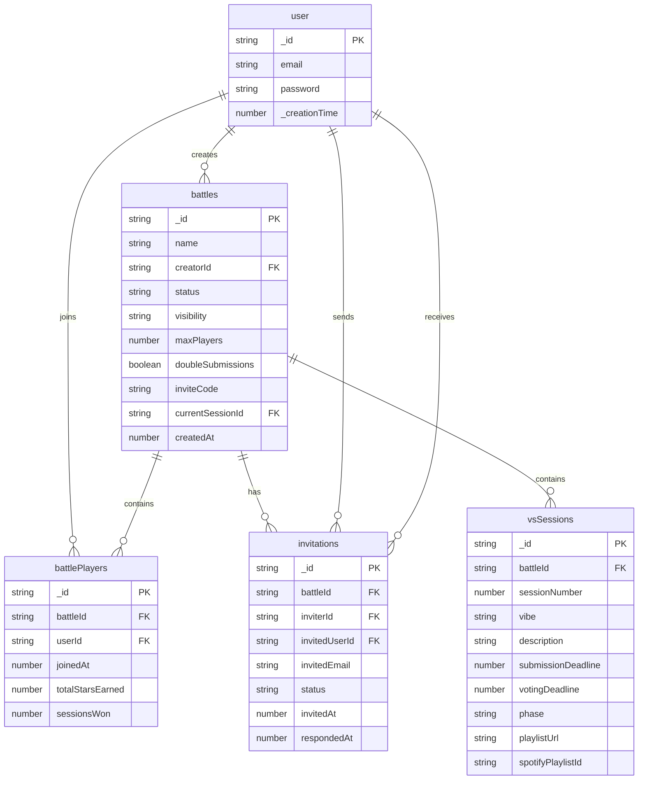
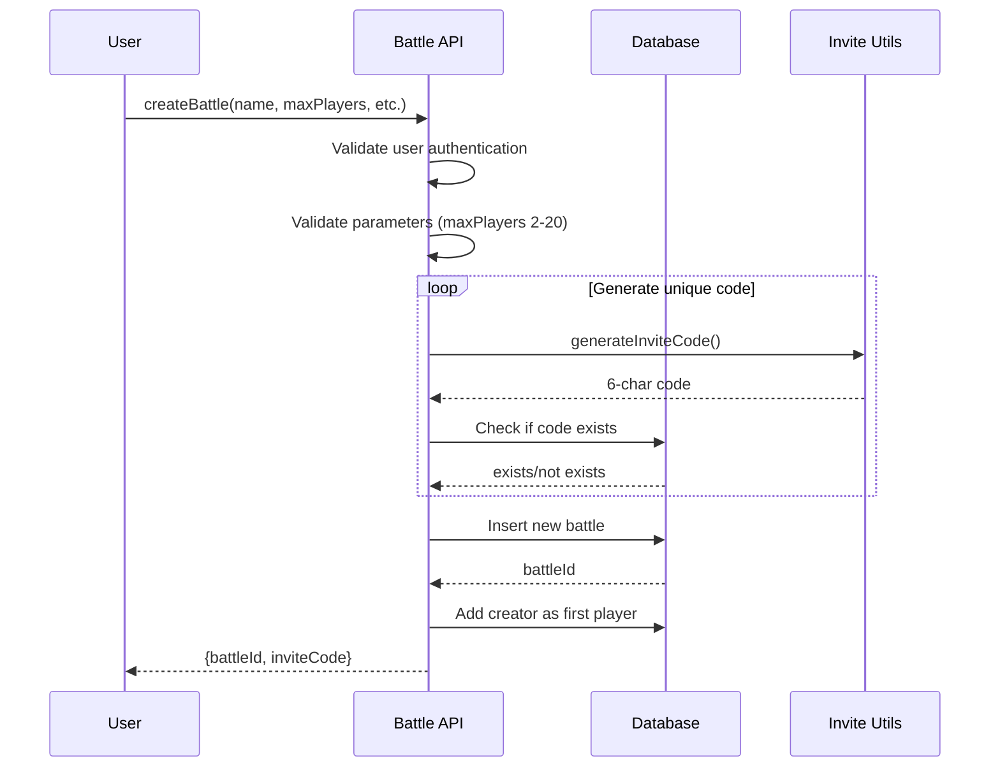
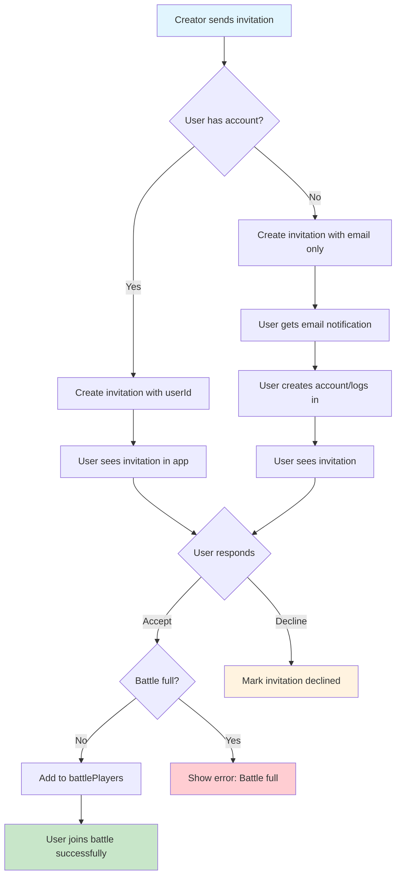
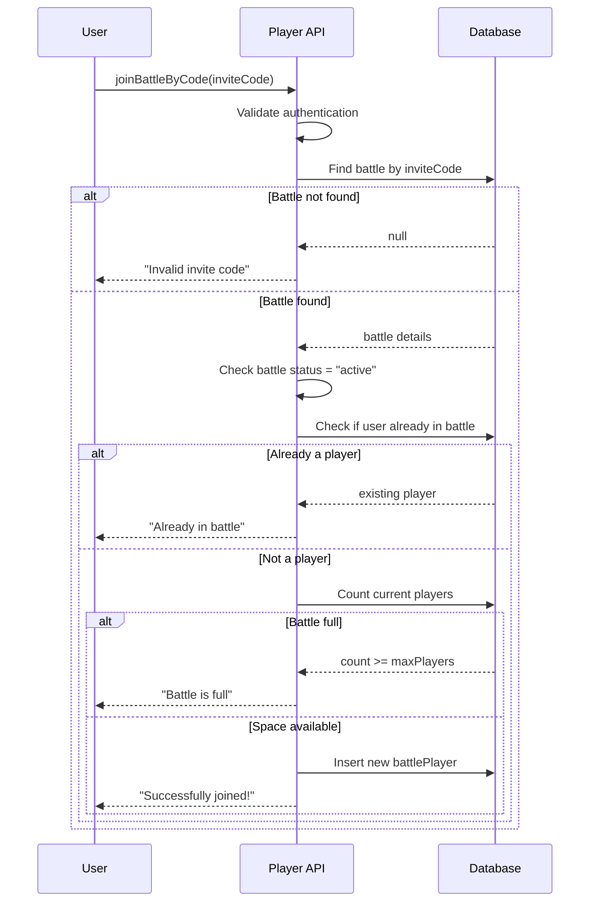
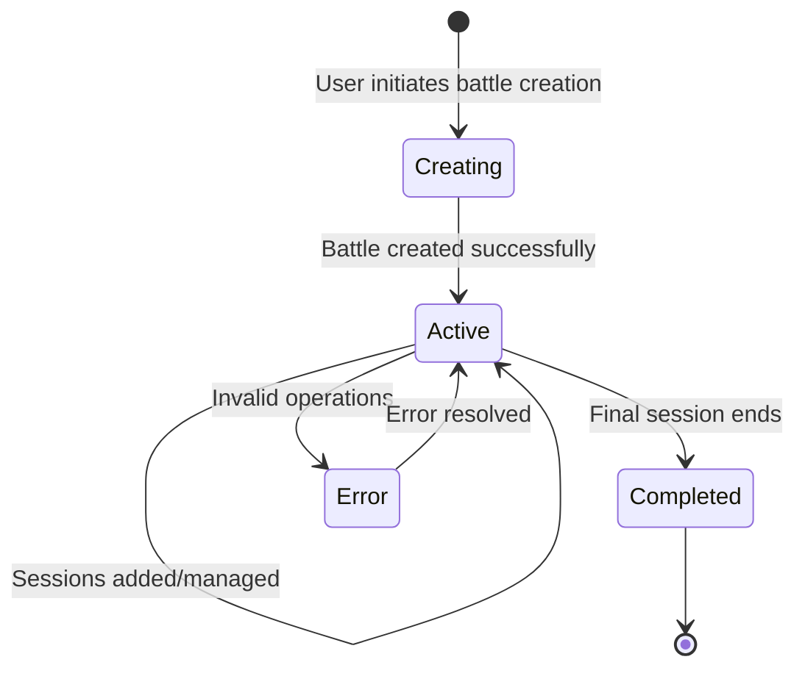

# Phase 1: Core Schema & Basic Battle Management

## Overview

This phase establishes the foundational database schema and implements basic battle creation, management, and player invitation systems.

## Entity Relationship Diagram



## Battle Creation Flow



## Player Invitation & Joining Flow



## Invite Code Joining Flow



## Database Schema

### Updated Schema Definition (`src/lib/server/convex/schema.ts`)

```typescript
import { defineSchema, defineTable } from "convex/server";
import { v } from "convex/values";

export default defineSchema({
  // Existing user and session tables remain unchanged
  user: defineTable({
    email: v.string(),
    password: v.string(),
  }).index("by_email", ["email"]),

  session: defineTable({
    sessionId: v.string(),
    userId: v.id("user"),
    expiresAt: v.number(),
  })
    .index("by_sessionId", ["sessionId"])
    .index("by_userId", ["userId"]),

  // New tables for Vsvs functionality
  battles: defineTable({
    name: v.string(),
    creatorId: v.id("user"),
    status: v.union(v.literal("active"), v.literal("completed")),
    visibility: v.union(v.literal("public"), v.literal("private")),
    maxPlayers: v.number(),
    doubleSubmissions: v.boolean(),
    inviteCode: v.string(),
    currentSessionId: v.optional(v.id("vsSessions")),
    createdAt: v.number(),
  })
    .index("by_creatorId", ["creatorId"])
    .index("by_inviteCode", ["inviteCode"])
    .index("by_status", ["status"])
    .index("by_visibility_and_status", ["visibility", "status"]),

  vsSessions: defineTable({
    battleId: v.id("battles"),
    sessionNumber: v.number(),
    vibe: v.string(),
    description: v.optional(v.string()),
    submissionDeadline: v.number(),
    votingDeadline: v.number(),
    phase: v.union(
      v.literal("pending"),
      v.literal("submission"),
      v.literal("voting"),
      v.literal("completed"),
    ),
    playlistUrl: v.optional(v.string()),
    spotifyPlaylistId: v.optional(v.string()),
  })
    .index("by_battleId", ["battleId"])
    .index("by_battleId_and_sessionNumber", ["battleId", "sessionNumber"]),

  battlePlayers: defineTable({
    battleId: v.id("battles"),
    userId: v.id("user"),
    joinedAt: v.number(),
    totalStarsEarned: v.number(),
    sessionsWon: v.number(),
  })
    .index("by_battleId", ["battleId"])
    .index("by_userId", ["userId"])
    .index("by_battle_and_user", ["battleId", "userId"]),

  invitations: defineTable({
    battleId: v.id("battles"),
    inviterId: v.id("user"),
    invitedUserId: v.optional(v.id("user")),
    invitedEmail: v.optional(v.string()),
    status: v.union(
      v.literal("pending"),
      v.literal("accepted"),
      v.literal("declined"),
    ),
    invitedAt: v.number(),
    respondedAt: v.optional(v.number()),
  })
    .index("by_battleId", ["battleId"])
    .index("by_invitedUserId", ["invitedUserId"])
    .index("by_invitedEmail", ["invitedEmail"])
    .index("by_status", ["status"]),
});
```

## Core Convex Functions

### Battle Management (`src/lib/server/convex/battles.ts`)

```typescript
import { query, mutation } from "./_generated/server";
import { v } from "convex/values";
import { generateInviteCode } from "../utils/invite-codes";

/**
 * Create a new battle
 */
export const createBattle = mutation({
  args: {
    name: v.string(),
    maxPlayers: v.number(),
    doubleSubmissions: v.boolean(),
    visibility: v.union(v.literal("public"), v.literal("private")),
  },
  returns: v.object({
    battleId: v.id("battles"),
    inviteCode: v.string(),
  }),
  handler: async (ctx, args) => {
    // Get authenticated user
    const identity = await ctx.auth.getUserIdentity();
    if (!identity) {
      throw new Error("Must be authenticated to create a battle");
    }

    const user = await ctx.db
      .query("user")
      .withIndex("by_email", (q) => q.eq("email", identity.email))
      .unique();

    if (!user) {
      throw new Error("User not found");
    }

    // Validate maxPlayers
    if (args.maxPlayers < 2 || args.maxPlayers > 20) {
      throw new Error("Max players must be between 2 and 20");
    }

    // Generate unique invite code
    let inviteCode: string;
    let codeExists = true;

    while (codeExists) {
      inviteCode = generateInviteCode();
      const existing = await ctx.db
        .query("battles")
        .withIndex("by_inviteCode", (q) => q.eq("inviteCode", inviteCode))
        .first();
      codeExists = !!existing;
    }

    const battleId = await ctx.db.insert("battles", {
      name: args.name,
      creatorId: user._id,
      status: "active",
      visibility: args.visibility,
      maxPlayers: args.maxPlayers,
      doubleSubmissions: args.doubleSubmissions,
      inviteCode: inviteCode!,
      createdAt: Date.now(),
    });

    // Add creator as first player
    await ctx.db.insert("battlePlayers", {
      battleId,
      userId: user._id,
      joinedAt: Date.now(),
      totalStarsEarned: 0,
      sessionsWon: 0,
    });

    return {
      battleId,
      inviteCode: inviteCode!,
    };
  },
});

/**
 * Get battle details by ID
 */
export const getBattle = query({
  args: { battleId: v.id("battles") },
  returns: v.union(
    v.null(),
    v.object({
      _id: v.id("battles"),
      name: v.string(),
      creatorId: v.id("user"),
      status: v.union(v.literal("active"), v.literal("completed")),
      visibility: v.union(v.literal("public"), v.literal("private")),
      maxPlayers: v.number(),
      doubleSubmissions: v.boolean(),
      inviteCode: v.string(),
      currentSessionId: v.optional(v.id("vsSessions")),
      createdAt: v.number(),
      playerCount: v.number(),
      canJoin: v.boolean(),
    }),
  ),
  handler: async (ctx, args) => {
    const battle = await ctx.db.get(args.battleId);
    if (!battle) return null;

    // Count current players
    const playerCount = await ctx.db
      .query("battlePlayers")
      .withIndex("by_battleId", (q) => q.eq("battleId", args.battleId))
      .collect()
      .then((players) => players.length);

    // Check if current user can join
    const identity = await ctx.auth.getUserIdentity();
    let canJoin = false;

    if (
      identity &&
      battle.status === "active" &&
      playerCount < battle.maxPlayers
    ) {
      const user = await ctx.db
        .query("user")
        .withIndex("by_email", (q) => q.eq("email", identity.email))
        .unique();

      if (user) {
        const existingPlayer = await ctx.db
          .query("battlePlayers")
          .withIndex("by_battle_and_user", (q) =>
            q.eq("battleId", args.battleId).eq("userId", user._id),
          )
          .first();
        canJoin = !existingPlayer;
      }
    }

    return {
      ...battle,
      playerCount,
      canJoin,
    };
  },
});

/**
 * Get battles created by current user
 */
export const getMyBattles = query({
  args: {},
  returns: v.array(
    v.object({
      _id: v.id("battles"),
      name: v.string(),
      status: v.union(v.literal("active"), v.literal("completed")),
      playerCount: v.number(),
      maxPlayers: v.number(),
      createdAt: v.number(),
      currentSessionNumber: v.optional(v.number()),
    }),
  ),
  handler: async (ctx) => {
    const identity = await ctx.auth.getUserIdentity();
    if (!identity) return [];

    const user = await ctx.db
      .query("user")
      .withIndex("by_email", (q) => q.eq("email", identity.email))
      .unique();

    if (!user) return [];

    const battles = await ctx.db
      .query("battles")
      .withIndex("by_creatorId", (q) => q.eq("creatorId", user._id))
      .order("desc")
      .collect();

    const battlesWithDetails = await Promise.all(
      battles.map(async (battle) => {
        const playerCount = await ctx.db
          .query("battlePlayers")
          .withIndex("by_battleId", (q) => q.eq("battleId", battle._id))
          .collect()
          .then((players) => players.length);

        let currentSessionNumber: number | undefined;
        if (battle.currentSessionId) {
          const currentSession = await ctx.db.get(battle.currentSessionId);
          currentSessionNumber = currentSession?.sessionNumber;
        }

        return {
          _id: battle._id,
          name: battle.name,
          status: battle.status,
          playerCount,
          maxPlayers: battle.maxPlayers,
          createdAt: battle.createdAt,
          currentSessionNumber,
        };
      }),
    );

    return battlesWithDetails;
  },
});
```

### Player Management (`src/lib/server/convex/players.ts`)

```typescript
import { query, mutation } from "./_generated/server";
import { v } from "convex/values";

/**
 * Get all players in a battle
 */
export const getBattlePlayers = query({
  args: { battleId: v.id("battles") },
  returns: v.array(
    v.object({
      _id: v.id("battlePlayers"),
      userId: v.id("user"),
      userEmail: v.string(),
      joinedAt: v.number(),
      totalStarsEarned: v.number(),
      sessionsWon: v.number(),
      isCreator: v.boolean(),
    }),
  ),
  handler: async (ctx, args) => {
    const battle = await ctx.db.get(args.battleId);
    if (!battle) return [];

    const players = await ctx.db
      .query("battlePlayers")
      .withIndex("by_battleId", (q) => q.eq("battleId", args.battleId))
      .collect();

    const playersWithDetails = await Promise.all(
      players.map(async (player) => {
        const user = await ctx.db.get(player.userId);
        return {
          _id: player._id,
          userId: player.userId,
          userEmail: user?.email || "Unknown",
          joinedAt: player.joinedAt,
          totalStarsEarned: player.totalStarsEarned,
          sessionsWon: player.sessionsWon,
          isCreator: player.userId === battle.creatorId,
        };
      }),
    );

    return playersWithDetails.sort(
      (a, b) => b.totalStarsEarned - a.totalStarsEarned,
    );
  },
});

/**
 * Join a battle via invite code
 */
export const joinBattleByCode = mutation({
  args: { inviteCode: v.string() },
  returns: v.object({
    success: v.boolean(),
    battleId: v.optional(v.id("battles")),
    message: v.string(),
  }),
  handler: async (ctx, args) => {
    const identity = await ctx.auth.getUserIdentity();
    if (!identity) {
      return {
        success: false,
        message: "Must be authenticated to join battle",
      };
    }

    const user = await ctx.db
      .query("user")
      .withIndex("by_email", (q) => q.eq("email", identity.email))
      .unique();

    if (!user) {
      return { success: false, message: "User not found" };
    }

    const battle = await ctx.db
      .query("battles")
      .withIndex("by_inviteCode", (q) => q.eq("inviteCode", args.inviteCode))
      .first();

    if (!battle) {
      return { success: false, message: "Invalid invite code" };
    }

    if (battle.status !== "active") {
      return { success: false, message: "This battle has ended" };
    }

    // Check if already a player
    const existingPlayer = await ctx.db
      .query("battlePlayers")
      .withIndex("by_battle_and_user", (q) =>
        q.eq("battleId", battle._id).eq("userId", user._id),
      )
      .first();

    if (existingPlayer) {
      return {
        success: true,
        battleId: battle._id,
        message: "You're already in this battle",
      };
    }

    // Check player limit
    const currentPlayers = await ctx.db
      .query("battlePlayers")
      .withIndex("by_battleId", (q) => q.eq("battleId", battle._id))
      .collect();

    if (currentPlayers.length >= battle.maxPlayers) {
      return { success: false, message: "This battle is full" };
    }

    // Add player to battle
    await ctx.db.insert("battlePlayers", {
      battleId: battle._id,
      userId: user._id,
      joinedAt: Date.now(),
      totalStarsEarned: 0,
      sessionsWon: 0,
    });

    return {
      success: true,
      battleId: battle._id,
      message: "Successfully joined the battle!",
    };
  },
});
```

### Invitation System (`src/lib/server/convex/invitations.ts`)

```typescript
import { query, mutation } from "./_generated/server";
import { v } from "convex/values";

/**
 * Send battle invitation to email
 */
export const sendInvitation = mutation({
  args: {
    battleId: v.id("battles"),
    invitedEmail: v.string(),
  },
  returns: v.object({
    success: v.boolean(),
    message: v.string(),
  }),
  handler: async (ctx, args) => {
    const identity = await ctx.auth.getUserIdentity();
    if (!identity) {
      return { success: false, message: "Must be authenticated" };
    }

    const user = await ctx.db
      .query("user")
      .withIndex("by_email", (q) => q.eq("email", identity.email))
      .unique();

    if (!user) {
      return { success: false, message: "User not found" };
    }

    const battle = await ctx.db.get(args.battleId);
    if (!battle) {
      return { success: false, message: "Battle not found" };
    }

    // Only creator can send invitations
    if (battle.creatorId !== user._id) {
      return {
        success: false,
        message: "Only battle creator can send invitations",
      };
    }

    // Check if invitation already exists
    const existingInvitation = await ctx.db
      .query("invitations")
      .withIndex("by_invitedEmail", (q) =>
        q.eq("invitedEmail", args.invitedEmail),
      )
      .filter((q) => q.eq(q.field("battleId"), args.battleId))
      .first();

    if (existingInvitation && existingInvitation.status === "pending") {
      return {
        success: false,
        message: "Invitation already sent to this email",
      };
    }

    // Check if user already registered and in battle
    const invitedUser = await ctx.db
      .query("user")
      .withIndex("by_email", (q) => q.eq("email", args.invitedEmail))
      .unique();

    if (invitedUser) {
      const existingPlayer = await ctx.db
        .query("battlePlayers")
        .withIndex("by_battle_and_user", (q) =>
          q.eq("battleId", args.battleId).eq("userId", invitedUser._id),
        )
        .first();

      if (existingPlayer) {
        return { success: false, message: "User is already in this battle" };
      }
    }

    // Create invitation
    await ctx.db.insert("invitations", {
      battleId: args.battleId,
      inviterId: user._id,
      invitedUserId: invitedUser?._id,
      invitedEmail: args.invitedEmail,
      status: "pending",
      invitedAt: Date.now(),
    });

    return { success: true, message: "Invitation sent successfully" };
  },
});

/**
 * Get pending invitations for current user
 */
export const getMyInvitations = query({
  args: {},
  returns: v.array(
    v.object({
      _id: v.id("invitations"),
      battleId: v.id("battles"),
      battleName: v.string(),
      inviterEmail: v.string(),
      invitedAt: v.number(),
      status: v.union(
        v.literal("pending"),
        v.literal("accepted"),
        v.literal("declined"),
      ),
    }),
  ),
  handler: async (ctx) => {
    const identity = await ctx.auth.getUserIdentity();
    if (!identity) return [];

    const user = await ctx.db
      .query("user")
      .withIndex("by_email", (q) => q.eq("email", identity.email))
      .unique();

    if (!user) return [];

    const invitations = await ctx.db
      .query("invitations")
      .withIndex("by_invitedUserId", (q) => q.eq("invitedUserId", user._id))
      .order("desc")
      .collect();

    const invitationsWithDetails = await Promise.all(
      invitations.map(async (invitation) => {
        const battle = await ctx.db.get(invitation.battleId);
        const inviter = await ctx.db.get(invitation.inviterId);

        return {
          _id: invitation._id,
          battleId: invitation.battleId,
          battleName: battle?.name || "Unknown Battle",
          inviterEmail: inviter?.email || "Unknown User",
          invitedAt: invitation.invitedAt,
          status: invitation.status,
        };
      }),
    );

    return invitationsWithDetails;
  },
});

/**
 * Accept or decline battle invitation
 */
export const respondToInvitation = mutation({
  args: {
    invitationId: v.id("invitations"),
    response: v.union(v.literal("accepted"), v.literal("declined")),
  },
  returns: v.object({
    success: v.boolean(),
    message: v.string(),
    battleId: v.optional(v.id("battles")),
  }),
  handler: async (ctx, args) => {
    const identity = await ctx.auth.getUserIdentity();
    if (!identity) {
      return { success: false, message: "Must be authenticated" };
    }

    const user = await ctx.db
      .query("user")
      .withIndex("by_email", (q) => q.eq("email", identity.email))
      .unique();

    if (!user) {
      return { success: false, message: "User not found" };
    }

    const invitation = await ctx.db.get(args.invitationId);
    if (!invitation) {
      return { success: false, message: "Invitation not found" };
    }

    if (invitation.invitedUserId !== user._id) {
      return { success: false, message: "This invitation is not for you" };
    }

    if (invitation.status !== "pending") {
      return {
        success: false,
        message: "Invitation has already been responded to",
      };
    }

    const battle = await ctx.db.get(invitation.battleId);
    if (!battle) {
      return { success: false, message: "Battle not found" };
    }

    if (battle.status !== "active") {
      return { success: false, message: "This battle has ended" };
    }

    // Update invitation status
    await ctx.db.patch(args.invitationId, {
      status: args.response,
      respondedAt: Date.now(),
    });

    if (args.response === "accepted") {
      // Check if battle is full
      const currentPlayers = await ctx.db
        .query("battlePlayers")
        .withIndex("by_battleId", (q) => q.eq("battleId", invitation.battleId))
        .collect();

      if (currentPlayers.length >= battle.maxPlayers) {
        return {
          success: false,
          message: "Battle is now full, cannot join",
        };
      }

      // Add to battle players
      await ctx.db.insert("battlePlayers", {
        battleId: invitation.battleId,
        userId: user._id,
        joinedAt: Date.now(),
        totalStarsEarned: 0,
        sessionsWon: 0,
      });

      return {
        success: true,
        message: "Successfully joined the battle!",
        battleId: invitation.battleId,
      };
    }

    return {
      success: true,
      message: "Invitation declined",
    };
  },
});
```

### Utility Functions (`src/lib/server/utils/invite-codes.ts`)

```typescript
/**
 * Generate a random 6-character invite code
 */
export function generateInviteCode(): string {
  const chars = "ABCDEFGHIJKLMNOPQRSTUVWXYZ0123456789";
  let result = "";

  for (let i = 0; i < 6; i++) {
    result += chars.charAt(Math.floor(Math.random() * chars.length));
  }

  return result;
}
```

## Battle State Diagram



## Validation Rules

1. **Battle Creation**:
   - Name must be 1-50 characters
   - Max players between 2-20
   - Creator automatically becomes first player

2. **Player Management**:
   - Cannot exceed battle max players limit
   - Users can only join once per battle
   - Creator cannot remove themselves

3. **Invitations**:
   - Only creator can send invitations
   - Cannot invite users already in battle
   - Cannot invite to completed battles
   - Pending invitations expire when battle ends

## Testing Requirements

1. **Unit Tests**:
   - Battle creation with various parameters
   - Invite code generation and uniqueness
   - Player joining via invite code
   - Invitation sending and responding

2. **Integration Tests**:
   - Full battle creation → invitation → acceptance flow
   - Edge cases: full battles, expired invitations
   - Permission validation

3. **Edge Cases**:
   - Concurrent player joins hitting max limit
   - Invalid invite codes
   - Battle creator attempting to leave
   - Duplicate invitations

## Next Phase Dependencies

Phase 2 (Session Management) requires:

- Battle creation and player management working
- User authentication system
- Basic battle state tracking

This phase provides the foundation for session scheduling and management in Phase 2.
