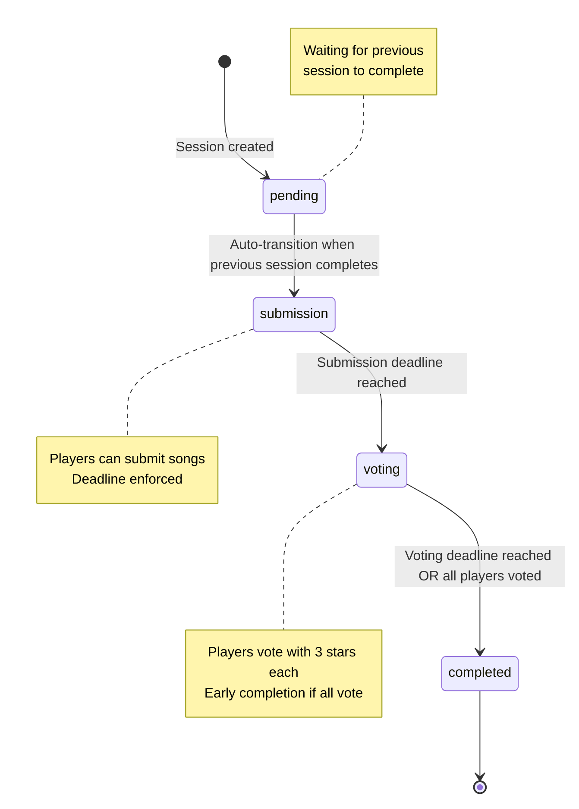
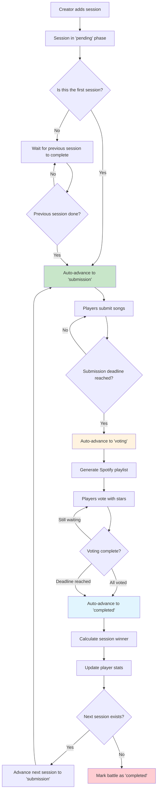

# Phase 2: Session Management & Phases

## Overview

This phase implements session creation, editing, and the automated phase transition system that drives the competition lifecycle.

## Session Phase State Machine



## Session Lifecycle Flow



## Convex Functions

### Session Management (`src/lib/server/convex/sessions.ts`)

```typescript
import { query, mutation, internalMutation } from "./_generated/server";
import { v } from "convex/values";
import { internal } from "./_generated/api";

/**
 * Add a new session to a battle
 */
export const addSession = mutation({
  args: {
    battleId: v.id("battles"),
    vibe: v.string(),
    description: v.optional(v.string()),
    submissionDeadline: v.number(),
    votingDeadline: v.number(),
  },
  returns: v.object({
    success: v.boolean(),
    sessionId: v.optional(v.id("vsSessions")),
    message: v.string(),
  }),
  handler: async (ctx, args) => {
    const identity = await ctx.auth.getUserIdentity();
    if (!identity) {
      return { success: false, message: "Must be authenticated" };
    }

    const user = await ctx.db
      .query("user")
      .withIndex("by_email", (q) => q.eq("email", identity.email))
      .unique();

    if (!user) {
      return { success: false, message: "User not found" };
    }

    const battle = await ctx.db.get(args.battleId);
    if (!battle) {
      return { success: false, message: "Battle not found" };
    }

    // Only creator can add sessions
    if (battle.creatorId !== user._id) {
      return {
        success: false,
        message: "Only battle creator can add sessions",
      };
    }

    if (battle.status !== "active") {
      return {
        success: false,
        message: "Cannot add sessions to completed battles",
      };
    }

    // Validate deadlines
    if (args.votingDeadline <= args.submissionDeadline) {
      return {
        success: false,
        message: "Voting deadline must be after submission deadline",
      };
    }

    if (args.submissionDeadline <= Date.now()) {
      return {
        success: false,
        message: "Submission deadline must be in the future",
      };
    }

    // Get next session number
    const existingSessions = await ctx.db
      .query("vsSessions")
      .withIndex("by_battleId", (q) => q.eq("battleId", args.battleId))
      .collect();

    const sessionNumber = existingSessions.length + 1;

    // Determine initial phase
    const phase = sessionNumber === 1 ? "submission" : "pending";

    const sessionId = await ctx.db.insert("vsSessions", {
      battleId: args.battleId,
      sessionNumber,
      vibe: args.vibe,
      description: args.description,
      submissionDeadline: args.submissionDeadline,
      votingDeadline: args.votingDeadline,
      phase,
    });

    // If this is the first session, update battle's currentSessionId
    if (sessionNumber === 1) {
      await ctx.db.patch(args.battleId, {
        currentSessionId: sessionId,
      });
    }

    return {
      success: true,
      sessionId,
      message: `Session ${sessionNumber} added successfully`,
    };
  },
});

/**
 * Update session details (only allowed for pending sessions)
 */
export const updateSession = mutation({
  args: {
    sessionId: v.id("vsSessions"),
    vibe: v.optional(v.string()),
    description: v.optional(v.string()),
    submissionDeadline: v.optional(v.number()),
    votingDeadline: v.optional(v.number()),
  },
  returns: v.object({
    success: v.boolean(),
    message: v.string(),
  }),
  handler: async (ctx, args) => {
    const identity = await ctx.auth.getUserIdentity();
    if (!identity) {
      return { success: false, message: "Must be authenticated" };
    }

    const user = await ctx.db
      .query("user")
      .withIndex("by_email", (q) => q.eq("email", identity.email))
      .unique();

    if (!user) {
      return { success: false, message: "User not found" };
    }

    const session = await ctx.db.get(args.sessionId);
    if (!session) {
      return { success: false, message: "Session not found" };
    }

    const battle = await ctx.db.get(session.battleId);
    if (!battle) {
      return { success: false, message: "Battle not found" };
    }

    // Only creator can update sessions
    if (battle.creatorId !== user._id) {
      return {
        success: false,
        message: "Only battle creator can update sessions",
      };
    }

    // Can only update pending sessions
    if (session.phase !== "pending") {
      return {
        success: false,
        message: "Can only update sessions that haven't started yet",
      };
    }

    // Validate new deadlines if provided
    const newSubmissionDeadline =
      args.submissionDeadline ?? session.submissionDeadline;
    const newVotingDeadline = args.votingDeadline ?? session.votingDeadline;

    if (newVotingDeadline <= newSubmissionDeadline) {
      return {
        success: false,
        message: "Voting deadline must be after submission deadline",
      };
    }

    if (newSubmissionDeadline <= Date.now()) {
      return {
        success: false,
        message: "Submission deadline must be in the future",
      };
    }

    // Update session
    const updates: any = {};
    if (args.vibe !== undefined) updates.vibe = args.vibe;
    if (args.description !== undefined) updates.description = args.description;
    if (args.submissionDeadline !== undefined)
      updates.submissionDeadline = args.submissionDeadline;
    if (args.votingDeadline !== undefined)
      updates.votingDeadline = args.votingDeadline;

    await ctx.db.patch(args.sessionId, updates);

    return { success: true, message: "Session updated successfully" };
  },
});

/**
 * Get all sessions for a battle
 */
export const getBattleSessions = query({
  args: { battleId: v.id("battles") },
  returns: v.array(
    v.object({
      _id: v.id("vsSessions"),
      sessionNumber: v.number(),
      vibe: v.string(),
      description: v.optional(v.string()),
      submissionDeadline: v.number(),
      votingDeadline: v.number(),
      phase: v.union(
        v.literal("pending"),
        v.literal("submission"),
        v.literal("voting"),
        v.literal("completed"),
      ),
      playlistUrl: v.optional(v.string()),
      submissionCount: v.number(),
      votingProgress: v.object({
        totalVoters: v.number(),
        votedCount: v.number(),
        remainingVoters: v.array(v.string()),
      }),
    }),
  ),
  handler: async (ctx, args) => {
    const sessions = await ctx.db
      .query("vsSessions")
      .withIndex("by_battleId", (q) => q.eq("battleId", args.battleId))
      .order("asc")
      .collect();

    const sessionsWithDetails = await Promise.all(
      sessions.map(async (session) => {
        // Count submissions (will be implemented in Phase 3)
        const submissionCount = 0; // Placeholder for Phase 3

        // Calculate voting progress (will be implemented in Phase 4)
        const votingProgress = {
          totalVoters: 0,
          votedCount: 0,
          remainingVoters: [],
        }; // Placeholder for Phase 4

        return {
          _id: session._id,
          sessionNumber: session.sessionNumber,
          vibe: session.vibe,
          description: session.description,
          submissionDeadline: session.submissionDeadline,
          votingDeadline: session.votingDeadline,
          phase: session.phase,
          playlistUrl: session.playlistUrl,
          submissionCount,
          votingProgress,
        };
      }),
    );

    return sessionsWithDetails;
  },
});

/**
 * Get current active session for a battle
 */
export const getCurrentSession = query({
  args: { battleId: v.id("battles") },
  returns: v.union(
    v.null(),
    v.object({
      _id: v.id("vsSessions"),
      sessionNumber: v.number(),
      vibe: v.string(),
      description: v.optional(v.string()),
      submissionDeadline: v.number(),
      votingDeadline: v.number(),
      phase: v.union(
        v.literal("submission"),
        v.literal("voting"),
        v.literal("completed"),
      ),
      playlistUrl: v.optional(v.string()),
      timeRemaining: v.object({
        phase: v.string(),
        milliseconds: v.number(),
        expired: v.boolean(),
      }),
    }),
  ),
  handler: async (ctx, args) => {
    const battle = await ctx.db.get(args.battleId);
    if (!battle || !battle.currentSessionId) return null;

    const session = await ctx.db.get(battle.currentSessionId);
    if (!session || session.phase === "pending") return null;

    const now = Date.now();
    let timeRemaining;

    switch (session.phase) {
      case "submission":
        timeRemaining = {
          phase: "submission",
          milliseconds: session.submissionDeadline - now,
          expired: session.submissionDeadline <= now,
        };
        break;
      case "voting":
        timeRemaining = {
          phase: "voting",
          milliseconds: session.votingDeadline - now,
          expired: session.votingDeadline <= now,
        };
        break;
      case "completed":
        timeRemaining = {
          phase: "completed",
          milliseconds: 0,
          expired: false,
        };
        break;
    }

    return {
      _id: session._id,
      sessionNumber: session.sessionNumber,
      vibe: session.vibe,
      description: session.description,
      submissionDeadline: session.submissionDeadline,
      votingDeadline: session.votingDeadline,
      phase: session.phase,
      playlistUrl: session.playlistUrl,
      timeRemaining,
    };
  },
});
```

### Phase Transition Logic (`src/lib/server/convex/phase-transitions.ts`)

```typescript
import { internalMutation, internalQuery } from "./_generated/server";
import { v } from "convex/values";
import { internal } from "./_generated/api";

/**
 * Check and advance session phases (called by cron job)
 */
export const checkPhaseTransitions = internalMutation({
  args: {},
  returns: v.null(),
  handler: async (ctx) => {
    const now = Date.now();

    // Find sessions that need phase transitions
    const activeSessions = await ctx.db
      .query("vsSessions")
      .filter((q) =>
        q.or(
          q.eq(q.field("phase"), "submission"),
          q.eq(q.field("phase"), "voting"),
        ),
      )
      .collect();

    for (const session of activeSessions) {
      if (session.phase === "submission" && session.submissionDeadline <= now) {
        // Advance to voting phase
        await ctx.db.patch(session._id, { phase: "voting" });

        // Schedule playlist generation
        await ctx.scheduler.runAfter(
          0,
          internal.spotify.generateSessionPlaylist,
          {
            sessionId: session._id,
          },
        );
      } else if (session.phase === "voting") {
        // Check if voting should end
        const shouldEndVoting =
          session.votingDeadline <= now ||
          (await checkAllPlayersVoted(ctx, session._id));

        if (shouldEndVoting) {
          // Advance to completed phase
          await ctx.db.patch(session._id, { phase: "completed" });

          // Calculate session winner and update stats
          await ctx.scheduler.runAfter(
            0,
            internal.sessions.calculateSessionWinner,
            {
              sessionId: session._id,
            },
          );

          // Check if this completes the battle or advances next session
          await ctx.scheduler.runAfter(
            0,
            internal.sessions.handleSessionCompletion,
            {
              sessionId: session._id,
            },
          );
        }
      }
    }

    return null;
  },
});

/**
 * Check if all players in a session have voted
 */
async function checkAllPlayersVoted(
  ctx: any,
  sessionId: string,
): Promise<boolean> {
  const session = await ctx.db.get(sessionId);
  if (!session) return false;

  // Get all players in the battle
  const players = await ctx.db
    .query("battlePlayers")
    .withIndex("by_battleId", (q) => q.eq("battleId", session.battleId))
    .collect();

  // Check if all players have used all 3 stars for this session
  for (const player of players) {
    const starCount = await ctx.db
      .query("stars")
      .withIndex("by_session_and_voter", (q) =>
        q.eq("sessionId", sessionId).eq("voterId", player.userId),
      )
      .collect()
      .then((stars) => stars.length);

    if (starCount < 3) {
      return false; // This player hasn't finished voting
    }
  }

  return true; // All players have voted
}

/**
 * Handle session completion - advance next session or end battle
 */
export const handleSessionCompletion = internalMutation({
  args: { sessionId: v.id("vsSessions") },
  returns: v.null(),
  handler: async (ctx, args) => {
    const session = await ctx.db.get(args.sessionId);
    if (!session) return null;

    const battle = await ctx.db.get(session.battleId);
    if (!battle) return null;

    // Find next session
    const nextSession = await ctx.db
      .query("vsSessions")
      .withIndex("by_battleId_and_sessionNumber", (q) =>
        q
          .eq("battleId", session.battleId)
          .eq("sessionNumber", session.sessionNumber + 1),
      )
      .first();

    if (nextSession) {
      // Advance next session to submission phase
      await ctx.db.patch(nextSession._id, { phase: "submission" });

      // Update battle's current session
      await ctx.db.patch(session.battleId, {
        currentSessionId: nextSession._id,
      });
    } else {
      // No more sessions - battle is complete
      await ctx.db.patch(session.battleId, {
        status: "completed",
        currentSessionId: undefined,
      });

      // Calculate battle champion
      await ctx.scheduler.runAfter(
        0,
        internal.sessions.calculateBattleChampion,
        {
          battleId: session.battleId,
        },
      );
    }

    return null;
  },
});

/**
 * Calculate session winner based on stars received
 */
export const calculateSessionWinner = internalMutation({
  args: { sessionId: v.id("vsSessions") },
  returns: v.null(),
  handler: async (ctx, args) => {
    // This will be implemented in Phase 4 when voting system is ready
    // For now, just update star counts on submissions and determine winner

    return null;
  },
});

/**
 * Calculate battle champion when battle ends
 */
export const calculateBattleChampion = internalMutation({
  args: { battleId: v.id("battles") },
  returns: v.null(),
  handler: async (ctx, args) => {
    const players = await ctx.db
      .query("battlePlayers")
      .withIndex("by_battleId", (q) => q.eq("battleId", args.battleId))
      .collect();

    // Find player(s) with most total stars
    const maxStars = Math.max(...players.map((p) => p.totalStarsEarned));
    const champions = players.filter((p) => p.totalStarsEarned === maxStars);

    // Update battle with champion(s) - this field needs to be added to schema
    // For now, we'll track champions in the battlePlayers totalStarsEarned field

    return null;
  },
});
```

### Cron Job Setup (`src/lib/server/convex/crons.ts`)

```typescript
import { cronJobs } from "convex/server";
import { internal } from "./_generated/api";

const crons = cronJobs();

// Check for phase transitions every minute
crons.interval(
  "check phase transitions",
  { minutes: 1 },
  internal.sessions.checkPhaseTransitions,
  {},
);

export default crons;
```

## Phase Transition Timeline

```mermaid
gantt
    title Session Timeline Example
    dateFormat X
    axisFormat %H:%M

    section Session 1
    Submission Phase    :active, sub1, 0, 3d
    Voting Phase       :voting1, after sub1, 2d
    Completed          :done, comp1, after voting1, 1d

    section Session 2
    Pending           :pending2, 0, 4d
    Submission Phase  :sub2, after comp1, 3d
    Voting Phase      :voting2, after sub2, 2d
    Completed         :comp2, after voting2, 1d

    section Session 3
    Pending           :pending3, 0, 9d
    Submission Phase  :sub3, after comp2, 3d
    Voting Phase      :voting3, after sub3, 2d
```



## Updated Schema Additions

Need to add to the existing schema from Phase 1:

```typescript
// Add to vsSessions table
vsSessions: defineTable({
  // ... existing fields
}).index("by_battleId", ["battleId"])
  .index("by_battleId_and_sessionNumber", ["battleId", "sessionNumber"])
  .index("by_phase", ["phase"])  // New index for phase transitions
  .index("by_submission_deadline", ["submissionDeadline"])  // New for cron jobs
  .index("by_voting_deadline", ["votingDeadline"]),  // New for cron jobs

// Add placeholders for Phase 4 (voting system)
stars: defineTable({
  sessionId: v.id("vsSessions"),
  voterId: v.id("user"),
  submissionId: v.id("submissions"),
  votedAt: v.number(),
}).index("by_sessionId", ["sessionId"])
  .index("by_session_and_voter", ["sessionId", "voterId"])
  .index("by_submissionId", ["submissionId"]),

// Add placeholders for Phase 3 (submissions)
submissions: defineTable({
  sessionId: v.id("vsSessions"),
  userId: v.id("user"),
  spotifyUrl: v.string(),
  submissionOrder: v.number(),
  submittedAt: v.number(),
  starsReceived: v.number(),
}).index("by_sessionId", ["sessionId"])
  .index("by_session_and_user", ["sessionId", "userId"])
  .index("by_session_and_url", ["sessionId", "spotifyUrl"]),
```

## Validation Rules

1. **Session Creation**:
   - Voting deadline must be after submission deadline
   - Submission deadline must be in future
   - Only battle creator can add sessions
   - Sessions get sequential numbers

2. **Session Updates**:
   - Only pending sessions can be modified
   - Same deadline validation applies
   - Cannot change session once it becomes active

3. **Phase Transitions**:
   - Automatic based on time or completion
   - Cannot manually override phase transitions
   - First session auto-starts, others wait

## Testing Requirements

1. **Unit Tests**:
   - Session creation with valid/invalid deadlines
   - Phase transition logic
   - Cron job execution
   - Permission validation

2. **Integration Tests**:
   - Full session lifecycle: pending → submission → voting → completed
   - Multiple session sequencing
   - Battle completion detection

3. **Edge Cases**:
   - Sessions with same deadlines
   - Battle completion mid-transition
   - Concurrent phase transitions

## Next Phase Dependencies

Phase 3 (Submission System) requires:

- Session phase management working
- Current session detection
- Phase transition triggers

This phase enables the time-based competition flow that drives user engagement.
