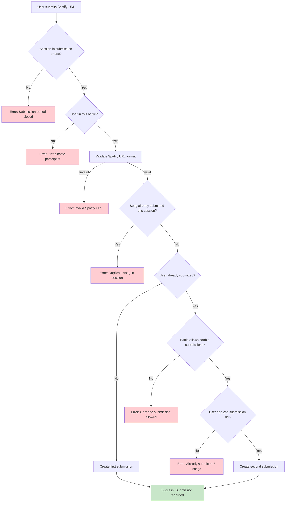
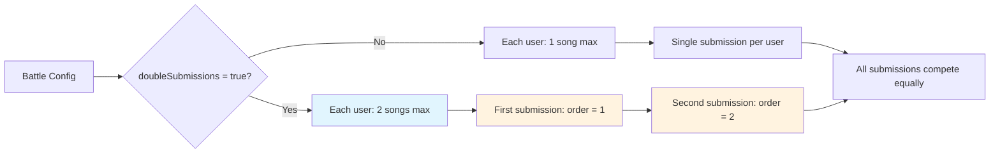
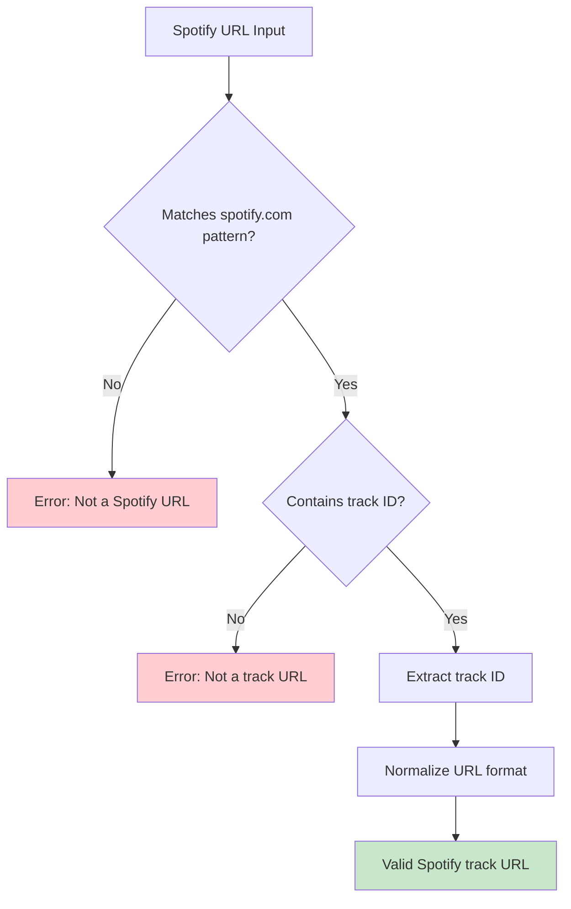
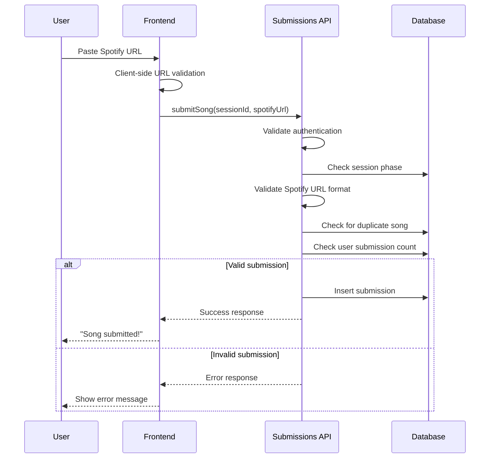

# Phase 3: Submission System

## Overview

This phase implements the song submission system with Spotify URL validation, duplicate prevention, and support for single/double submissions based on battle configuration.

## Submission Flow Diagram



## Double Submission Logic



## Spotify URL Validation



## Core Convex Functions

### Submission Management (`src/lib/server/convex/submissions.ts`)

```typescript
import { query, mutation, internalQuery } from "./_generated/server";
import { v } from "convex/values";
import { validateSpotifyUrl, normalizeSpotifyUrl } from "../utils/spotify-urls";

/**
 * Submit a song to the current session
 */
export const submitSong = mutation({
  args: {
    sessionId: v.id("vsSessions"),
    spotifyUrl: v.string(),
  },
  returns: v.object({
    success: v.boolean(),
    submissionId: v.optional(v.id("submissions")),
    message: v.string(),
  }),
  handler: async (ctx, args) => {
    const identity = await ctx.auth.getUserIdentity();
    if (!identity) {
      return { success: false, message: "Must be authenticated to submit" };
    }

    const user = await ctx.db
      .query("user")
      .withIndex("by_email", (q) => q.eq("email", identity.email))
      .unique();

    if (!user) {
      return { success: false, message: "User not found" };
    }

    const session = await ctx.db.get(args.sessionId);
    if (!session) {
      return { success: false, message: "Session not found" };
    }

    // Check if session is in submission phase
    if (session.phase !== "submission") {
      return {
        success: false,
        message:
          session.phase === "pending"
            ? "Submission period hasn't started yet"
            : "Submission period has ended",
      };
    }

    // Check if submission deadline has passed
    if (Date.now() > session.submissionDeadline) {
      return { success: false, message: "Submission deadline has passed" };
    }

    const battle = await ctx.db.get(session.battleId);
    if (!battle) {
      return { success: false, message: "Battle not found" };
    }

    // Check if user is a player in this battle
    const player = await ctx.db
      .query("battlePlayers")
      .withIndex("by_battle_and_user", (q) =>
        q.eq("battleId", session.battleId).eq("userId", user._id),
      )
      .first();

    if (!player) {
      return {
        success: false,
        message: "You are not a participant in this battle",
      };
    }

    // Validate Spotify URL
    const urlValidation = validateSpotifyUrl(args.spotifyUrl);
    if (!urlValidation.isValid) {
      return { success: false, message: urlValidation.error! };
    }

    const normalizedUrl = normalizeSpotifyUrl(args.spotifyUrl);

    // Check for duplicate song in this session
    const existingSubmission = await ctx.db
      .query("submissions")
      .withIndex("by_session_and_url", (q) =>
        q.eq("sessionId", args.sessionId).eq("spotifyUrl", normalizedUrl),
      )
      .first();

    if (existingSubmission) {
      const existingUser = await ctx.db.get(existingSubmission.userId);
      return {
        success: false,
        message: `This song was already submitted by ${existingUser?.email || "another user"}`,
      };
    }

    // Get user's existing submissions for this session
    const userSubmissions = await ctx.db
      .query("submissions")
      .withIndex("by_session_and_user", (q) =>
        q.eq("sessionId", args.sessionId).eq("userId", user._id),
      )
      .collect();

    // Determine submission order
    let submissionOrder: number;

    if (userSubmissions.length === 0) {
      submissionOrder = 1; // First submission
    } else if (userSubmissions.length === 1 && battle.doubleSubmissions) {
      submissionOrder = 2; // Second submission allowed
    } else if (userSubmissions.length === 1 && !battle.doubleSubmissions) {
      return {
        success: false,
        message: "You have already submitted a song for this session",
      };
    } else {
      return {
        success: false,
        message: "You have already submitted the maximum number of songs",
      };
    }

    // Create submission
    const submissionId = await ctx.db.insert("submissions", {
      sessionId: args.sessionId,
      userId: user._id,
      spotifyUrl: normalizedUrl,
      submissionOrder,
      submittedAt: Date.now(),
      starsReceived: 0,
    });

    const orderText = battle.doubleSubmissions
      ? submissionOrder === 1
        ? " (1st song)"
        : " (2nd song)"
      : "";

    return {
      success: true,
      submissionId,
      message: `Song submitted successfully${orderText}!`,
    };
  },
});

/**
 * Get all submissions for a session
 */
export const getSessionSubmissions = query({
  args: { sessionId: v.id("vsSessions") },
  returns: v.array(
    v.object({
      _id: v.id("submissions"),
      userId: v.id("user"),
      userEmail: v.string(),
      spotifyUrl: v.string(),
      submissionOrder: v.number(),
      submittedAt: v.number(),
      starsReceived: v.number(),
      isCurrentUser: v.boolean(),
    }),
  ),
  handler: async (ctx, args) => {
    const submissions = await ctx.db
      .query("submissions")
      .withIndex("by_sessionId", (q) => q.eq("sessionId", args.sessionId))
      .collect();

    // Get current user for isCurrentUser flag
    const identity = await ctx.auth.getUserIdentity();
    let currentUserId: string | null = null;

    if (identity) {
      const currentUser = await ctx.db
        .query("user")
        .withIndex("by_email", (q) => q.eq("email", identity.email))
        .unique();
      currentUserId = currentUser?._id || null;
    }

    const submissionsWithDetails = await Promise.all(
      submissions.map(async (submission) => {
        const user = await ctx.db.get(submission.userId);

        return {
          _id: submission._id,
          userId: submission.userId,
          userEmail: user?.email || "Unknown User",
          spotifyUrl: submission.spotifyUrl,
          submissionOrder: submission.submissionOrder,
          submittedAt: submission.submittedAt,
          starsReceived: submission.starsReceived,
          isCurrentUser: submission.userId === currentUserId,
        };
      }),
    );

    // Sort by submission time
    return submissionsWithDetails.sort((a, b) => a.submittedAt - b.submittedAt);
  },
});

/**
 * Get current user's submissions for a session
 */
export const getMySessionSubmissions = query({
  args: { sessionId: v.id("vsSessions") },
  returns: v.array(
    v.object({
      _id: v.id("submissions"),
      spotifyUrl: v.string(),
      submissionOrder: v.number(),
      submittedAt: v.number(),
      starsReceived: v.number(),
    }),
  ),
  handler: async (ctx, args) => {
    const identity = await ctx.auth.getUserIdentity();
    if (!identity) return [];

    const user = await ctx.db
      .query("user")
      .withIndex("by_email", (q) => q.eq("email", identity.email))
      .unique();

    if (!user) return [];

    const submissions = await ctx.db
      .query("submissions")
      .withIndex("by_session_and_user", (q) =>
        q.eq("sessionId", args.sessionId).eq("userId", user._id),
      )
      .collect();

    return submissions
      .map((submission) => ({
        _id: submission._id,
        spotifyUrl: submission.spotifyUrl,
        submissionOrder: submission.submissionOrder,
        submittedAt: submission.submittedAt,
        starsReceived: submission.starsReceived,
      }))
      .sort((a, b) => a.submissionOrder - b.submissionOrder);
  },
});

/**
 * Remove a submission (only before deadline)
 */
export const removeSubmission = mutation({
  args: { submissionId: v.id("submissions") },
  returns: v.object({
    success: v.boolean(),
    message: v.string(),
  }),
  handler: async (ctx, args) => {
    const identity = await ctx.auth.getUserIdentity();
    if (!identity) {
      return { success: false, message: "Must be authenticated" };
    }

    const user = await ctx.db
      .query("user")
      .withIndex("by_email", (q) => q.eq("email", identity.email))
      .unique();

    if (!user) {
      return { success: false, message: "User not found" };
    }

    const submission = await ctx.db.get(args.submissionId);
    if (!submission) {
      return { success: false, message: "Submission not found" };
    }

    // Check if user owns this submission
    if (submission.userId !== user._id) {
      return {
        success: false,
        message: "You can only remove your own submissions",
      };
    }

    const session = await ctx.db.get(submission.sessionId);
    if (!session) {
      return { success: false, message: "Session not found" };
    }

    // Check if still in submission phase
    if (session.phase !== "submission") {
      return {
        success: false,
        message: "Cannot remove submission after submission period ends",
      };
    }

    // Check if submission deadline has passed
    if (Date.now() > session.submissionDeadline) {
      return {
        success: false,
        message: "Cannot remove submission after deadline",
      };
    }

    // Remove the submission
    await ctx.db.delete(args.submissionId);

    return { success: true, message: "Submission removed successfully" };
  },
});

/**
 * Get submission statistics for a session
 */
export const getSessionSubmissionStats = query({
  args: { sessionId: v.id("vsSessions") },
  returns: v.object({
    totalSubmissions: v.number(),
    uniqueSubmitters: v.number(),
    submissionsByUser: v.array(
      v.object({
        userId: v.id("user"),
        userEmail: v.string(),
        submissionCount: v.number(),
        submissions: v.array(
          v.object({
            _id: v.id("submissions"),
            submissionOrder: v.number(),
            submittedAt: v.number(),
          }),
        ),
      }),
    ),
  }),
  handler: async (ctx, args) => {
    const submissions = await ctx.db
      .query("submissions")
      .withIndex("by_sessionId", (q) => q.eq("sessionId", args.sessionId))
      .collect();

    const userSubmissions = new Map<
      string,
      {
        user: any;
        submissions: any[];
      }
    >();

    for (const submission of submissions) {
      const userId = submission.userId;

      if (!userSubmissions.has(userId)) {
        const user = await ctx.db.get(userId);
        userSubmissions.set(userId, {
          user,
          submissions: [],
        });
      }

      userSubmissions.get(userId)!.submissions.push({
        _id: submission._id,
        submissionOrder: submission.submissionOrder,
        submittedAt: submission.submittedAt,
      });
    }

    const submissionsByUser = Array.from(userSubmissions.entries()).map(
      ([userId, data]) => ({
        userId,
        userEmail: data.user?.email || "Unknown User",
        submissionCount: data.submissions.length,
        submissions: data.submissions.sort(
          (a, b) => a.submissionOrder - b.submissionOrder,
        ),
      }),
    );

    return {
      totalSubmissions: submissions.length,
      uniqueSubmitters: userSubmissions.size,
      submissionsByUser: submissionsByUser.sort((a, b) =>
        a.userEmail.localeCompare(b.userEmail),
      ),
    };
  },
});
```

### Spotify URL Utilities (`src/lib/server/utils/spotify-urls.ts`)

```typescript
/**
 * Spotify URL validation and normalization utilities
 */

interface SpotifyUrlValidation {
  isValid: boolean;
  trackId?: string;
  error?: string;
}

/**
 * Validate if URL is a valid Spotify track URL
 */
export function validateSpotifyUrl(url: string): SpotifyUrlValidation {
  if (!url || typeof url !== "string") {
    return { isValid: false, error: "URL is required" };
  }

  // Remove any whitespace
  const cleanUrl = url.trim();

  // Check if it's a Spotify URL
  if (!cleanUrl.includes("spotify.com") && !cleanUrl.startsWith("spotify:")) {
    return { isValid: false, error: "Must be a Spotify URL" };
  }

  // Extract track ID from different URL formats
  let trackId: string | null = null;

  // Format 1: https://open.spotify.com/track/4iV5W9uYEdYUVa79Axb7Rh
  const webMatch = cleanUrl.match(/spotify\.com\/track\/([a-zA-Z0-9]+)/);
  if (webMatch) {
    trackId = webMatch[1];
  }

  // Format 2: https://open.spotify.com/track/4iV5W9uYEdYUVa79Axb7Rh?si=...
  if (!trackId) {
    const webWithParamsMatch = cleanUrl.match(
      /spotify\.com\/track\/([a-zA-Z0-9]+)\?/,
    );
    if (webWithParamsMatch) {
      trackId = webWithParamsMatch[1];
    }
  }

  // Format 3: spotify:track:4iV5W9uYEdYUVa79Axb7Rh
  if (!trackId) {
    const uriMatch = cleanUrl.match(/spotify:track:([a-zA-Z0-9]+)/);
    if (uriMatch) {
      trackId = uriMatch[1];
    }
  }

  if (!trackId) {
    return { isValid: false, error: "Invalid Spotify track URL format" };
  }

  // Validate track ID format (Spotify track IDs are 22 characters, base62)
  if (trackId.length !== 22 || !/^[a-zA-Z0-9]+$/.test(trackId)) {
    return { isValid: false, error: "Invalid Spotify track ID format" };
  }

  return { isValid: true, trackId };
}

/**
 * Normalize Spotify URL to consistent format
 */
export function normalizeSpotifyUrl(url: string): string {
  const validation = validateSpotifyUrl(url);

  if (!validation.isValid || !validation.trackId) {
    throw new Error("Cannot normalize invalid Spotify URL");
  }

  // Return clean web URL format
  return `https://open.spotify.com/track/${validation.trackId}`;
}

/**
 * Extract track ID from Spotify URL
 */
export function extractSpotifyTrackId(url: string): string | null {
  const validation = validateSpotifyUrl(url);
  return validation.isValid ? validation.trackId! : null;
}
```

## Updated Schema Additions

Complete the submissions table in the schema:

```typescript
// Add to schema.ts
submissions: defineTable({
  sessionId: v.id("vsSessions"),
  userId: v.id("user"),
  spotifyUrl: v.string(),
  submissionOrder: v.number(), // 1 or 2 for double submissions
  submittedAt: v.number(),
  starsReceived: v.number(), // Updated by voting system
}).index("by_sessionId", ["sessionId"])
  .index("by_session_and_user", ["sessionId", "userId"])
  .index("by_session_and_url", ["sessionId", "spotifyUrl"])
  .index("by_userId", ["userId"]),
```

## Submission Timeline

```mermaid
gantt
    title Submission Phase Timeline
    dateFormat X
    axisFormat %H:%M

    section Player 1
    First Song     :done, p1s1, 0, 30m
    Second Song    :done, p1s2, 1h, 2h

    section Player 2
    First Song     :done, p2s1, 30m, 1h30m
    Second Song    :active, p2s2, 2h30m, 3h

    section Player 3
    First Song     :p3s1, 4h, 5h

    section Deadline
    Submission Ends :crit, deadline, 6h, 6h
```

## Validation Rules

1. **URL Validation**:
   - Must be valid Spotify track URL
   - Supports multiple formats (web, URI)
   - Normalized to consistent format
   - Track ID must be 22 characters

2. **Duplicate Prevention**:
   - Same song cannot be submitted twice in session
   - Case-insensitive URL comparison
   - Parameters stripped during normalization

3. **Submission Limits**:
   - Single submissions: 1 song per user
   - Double submissions: 2 songs per user
   - Based on battle configuration

4. **Timing Constraints**:
   - Only during submission phase
   - Before submission deadline
   - Can remove before deadline

## Testing Requirements

1. **Unit Tests**:
   - Spotify URL validation with various formats
   - Duplicate detection logic
   - Submission order assignment
   - Permission validation

2. **Integration Tests**:
   - Full submission flow
   - Double submission scenarios
   - Deadline enforcement
   - Session phase transitions

3. **Edge Cases**:
   - Malformed Spotify URLs
   - Concurrent submissions of same song
   - Submissions at exact deadline
   - Mixed single/double submission battles

## User Experience Flow



## Next Phase Dependencies

Phase 4 (Voting System) requires:

- Submission data structure
- User submission tracking
- Session submission counts

This phase provides the content that users will vote on in Phase 4.
