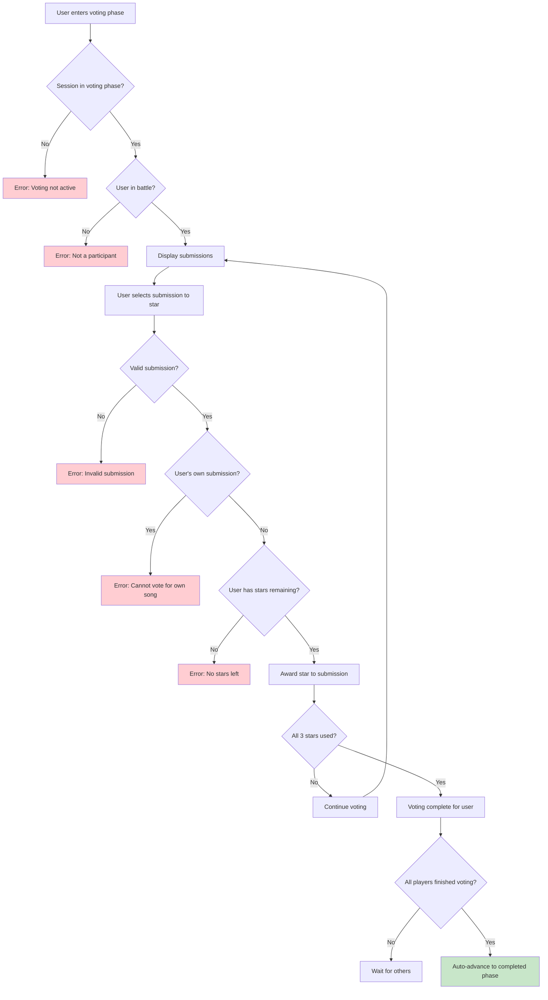
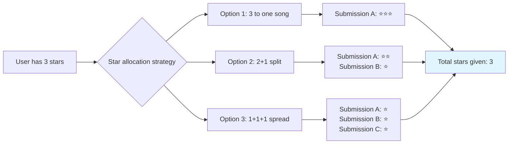
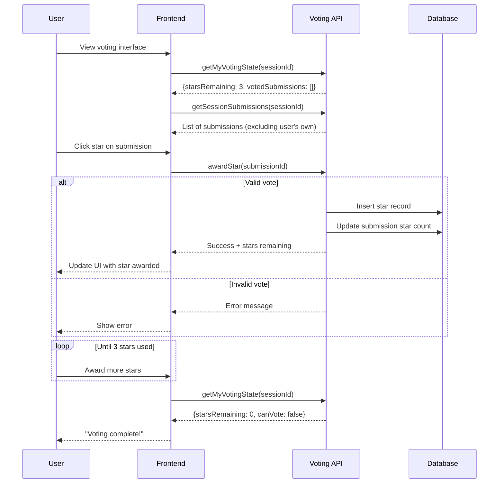
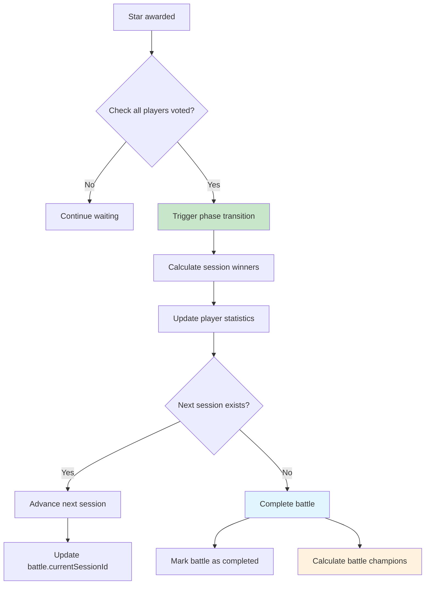

# Phase 4: Voting System

## Overview

This phase implements the 3-star voting system where players distribute stars to their favorite submissions, with automatic session winner calculation and battle progression.

## Voting Flow Diagram



## Star Distribution Logic



## Winner Calculation Process

```mermaid
flowchart TD
    A[Voting phase ends] --> B[Count stars for each submission]
    B --> C[Group submissions by user]
    C --> D[Sum stars per user]

    D --> E{Tie for most stars?}
    E -->|No| F[Single winner declared]
    E -->|Yes| G[Multiple winners (tie)]

    F --> H[Update winner's sessionsWon +1]
    G --> I[Update all winners' sessionsWon +1]

    H --> J[Update all players' totalStarsEarned]
    I --> J

    J --> K[Calculate session completion]

    style F fill:#c8e6c9
    style G fill:#fff3e0
    style K fill:#e1f5fe
```

## Core Convex Functions

### Voting System (`src/lib/server/convex/voting.ts`)

```typescript
import { query, mutation, internalMutation } from "./_generated/server";
import { v } from "convex/values";

/**
 * Award a star to a submission
 */
export const awardStar = mutation({
  args: {
    submissionId: v.id("submissions"),
  },
  returns: v.object({
    success: v.boolean(),
    message: v.string(),
    starsRemaining: v.optional(v.number()),
  }),
  handler: async (ctx, args) => {
    const identity = await ctx.auth.getUserIdentity();
    if (!identity) {
      return { success: false, message: "Must be authenticated to vote" };
    }

    const user = await ctx.db
      .query("user")
      .withIndex("by_email", (q) => q.eq("email", identity.email))
      .unique();

    if (!user) {
      return { success: false, message: "User not found" };
    }

    const submission = await ctx.db.get(args.submissionId);
    if (!submission) {
      return { success: false, message: "Submission not found" };
    }

    const session = await ctx.db.get(submission.sessionId);
    if (!session) {
      return { success: false, message: "Session not found" };
    }

    // Check if session is in voting phase
    if (session.phase !== "voting") {
      return {
        success: false,
        message:
          session.phase === "submission"
            ? "Voting hasn't started yet"
            : "Voting period has ended",
      };
    }

    // Check if voting deadline has passed
    if (Date.now() > session.votingDeadline) {
      return { success: false, message: "Voting deadline has passed" };
    }

    // Check if user is a player in this battle
    const player = await ctx.db
      .query("battlePlayers")
      .withIndex("by_battle_and_user", (q) =>
        q.eq("battleId", session.battleId).eq("userId", user._id),
      )
      .first();

    if (!player) {
      return {
        success: false,
        message: "You are not a participant in this battle",
      };
    }

    // Check if user is trying to vote for their own submission
    if (submission.userId === user._id) {
      return {
        success: false,
        message: "You cannot vote for your own submission",
      };
    }

    // Check how many stars user has already used in this session
    const existingStars = await ctx.db
      .query("stars")
      .withIndex("by_session_and_voter", (q) =>
        q.eq("sessionId", submission.sessionId).eq("voterId", user._id),
      )
      .collect();

    if (existingStars.length >= 3) {
      return {
        success: false,
        message: "You have already used all 3 stars for this session",
      };
    }

    // Award the star
    await ctx.db.insert("stars", {
      sessionId: submission.sessionId,
      voterId: user._id,
      submissionId: args.submissionId,
      votedAt: Date.now(),
    });

    // Update submission's star count
    await ctx.db.patch(args.submissionId, {
      starsReceived: submission.starsReceived + 1,
    });

    const starsRemaining = 2 - existingStars.length;

    return {
      success: true,
      message: `Star awarded! You have ${starsRemaining} stars remaining.`,
      starsRemaining,
    };
  },
});

/**
 * Remove a star from a submission (undo vote)
 */
export const removeStar = mutation({
  args: {
    submissionId: v.id("submissions"),
  },
  returns: v.object({
    success: v.boolean(),
    message: v.string(),
    starsRemaining: v.optional(v.number()),
  }),
  handler: async (ctx, args) => {
    const identity = await ctx.auth.getUserIdentity();
    if (!identity) {
      return { success: false, message: "Must be authenticated" };
    }

    const user = await ctx.db
      .query("user")
      .withIndex("by_email", (q) => q.eq("email", identity.email))
      .unique();

    if (!user) {
      return { success: false, message: "User not found" };
    }

    const submission = await ctx.db.get(args.submissionId);
    if (!submission) {
      return { success: false, message: "Submission not found" };
    }

    const session = await ctx.db.get(submission.sessionId);
    if (!session) {
      return { success: false, message: "Session not found" };
    }

    // Check if session is still in voting phase
    if (session.phase !== "voting") {
      return {
        success: false,
        message: "Cannot change votes outside voting period",
      };
    }

    // Check if voting deadline has passed
    if (Date.now() > session.votingDeadline) {
      return { success: false, message: "Voting deadline has passed" };
    }

    // Find the star to remove
    const starToRemove = await ctx.db
      .query("stars")
      .withIndex("by_session_and_voter", (q) =>
        q.eq("sessionId", submission.sessionId).eq("voterId", user._id),
      )
      .filter((q) => q.eq(q.field("submissionId"), args.submissionId))
      .first();

    if (!starToRemove) {
      return {
        success: false,
        message: "You haven't voted for this submission",
      };
    }

    // Remove the star
    await ctx.db.delete(starToRemove._id);

    // Update submission's star count
    await ctx.db.patch(args.submissionId, {
      starsReceived: Math.max(0, submission.starsReceived - 1),
    });

    // Count remaining stars
    const remainingStars = await ctx.db
      .query("stars")
      .withIndex("by_session_and_voter", (q) =>
        q.eq("sessionId", submission.sessionId).eq("voterId", user._id),
      )
      .collect();

    const starsRemaining = 3 - remainingStars.length;

    return {
      success: true,
      message: `Star removed! You have ${starsRemaining} stars remaining.`,
      starsRemaining,
    };
  },
});

/**
 * Get voting state for current user in a session
 */
export const getMyVotingState = query({
  args: { sessionId: v.id("vsSessions") },
  returns: v.union(
    v.null(),
    v.object({
      starsRemaining: v.number(),
      votedSubmissions: v.array(v.id("submissions")),
      canVote: v.boolean(),
    }),
  ),
  handler: async (ctx, args) => {
    const identity = await ctx.auth.getUserIdentity();
    if (!identity) return null;

    const user = await ctx.db
      .query("user")
      .withIndex("by_email", (q) => q.eq("email", identity.email))
      .unique();

    if (!user) return null;

    const session = await ctx.db.get(args.sessionId);
    if (!session) return null;

    // Check if user is a player in this battle
    const player = await ctx.db
      .query("battlePlayers")
      .withIndex("by_battle_and_user", (q) =>
        q.eq("battleId", session.battleId).eq("userId", user._id),
      )
      .first();

    if (!player) return null;

    // Get user's stars for this session
    const userStars = await ctx.db
      .query("stars")
      .withIndex("by_session_and_voter", (q) =>
        q.eq("sessionId", args.sessionId).eq("voterId", user._id),
      )
      .collect();

    const votedSubmissions = userStars.map((star) => star.submissionId);
    const starsRemaining = 3 - userStars.length;
    const canVote =
      session.phase === "voting" &&
      Date.now() <= session.votingDeadline &&
      starsRemaining > 0;

    return {
      starsRemaining,
      votedSubmissions,
      canVote,
    };
  },
});

/**
 * Get voting summary for a session
 */
export const getSessionVotingSummary = query({
  args: { sessionId: v.id("vsSessions") },
  returns: v.object({
    totalVoters: v.number(),
    completedVoters: v.number(),
    votingProgress: v.number(), // 0-100 percentage
    submissionResults: v.array(
      v.object({
        submissionId: v.id("submissions"),
        userId: v.id("user"),
        userEmail: v.string(),
        spotifyUrl: v.string(),
        submissionOrder: v.number(),
        starsReceived: v.number(),
        voters: v.array(v.string()), // voter emails
      }),
    ),
    winners: v.array(
      v.object({
        userId: v.id("user"),
        userEmail: v.string(),
        totalStars: v.number(),
        submissions: v.array(v.id("submissions")),
      }),
    ),
  }),
  handler: async (ctx, args) => {
    const session = await ctx.db.get(args.sessionId);
    if (!session) {
      throw new Error("Session not found");
    }

    // Get all battle players
    const battlePlayers = await ctx.db
      .query("battlePlayers")
      .withIndex("by_battleId", (q) => q.eq("battleId", session.battleId))
      .collect();

    const totalVoters = battlePlayers.length;

    // Count players who have used all 3 stars
    const voterProgress = await Promise.all(
      battlePlayers.map(async (player) => {
        const stars = await ctx.db
          .query("stars")
          .withIndex("by_session_and_voter", (q) =>
            q.eq("sessionId", args.sessionId).eq("voterId", player.userId),
          )
          .collect();
        return { userId: player.userId, starsUsed: stars.length };
      }),
    );

    const completedVoters = voterProgress.filter(
      (v) => v.starsUsed === 3,
    ).length;
    const votingProgress =
      totalVoters > 0 ? Math.round((completedVoters / totalVoters) * 100) : 0;

    // Get submissions with vote details
    const submissions = await ctx.db
      .query("submissions")
      .withIndex("by_sessionId", (q) => q.eq("sessionId", args.sessionId))
      .collect();

    const submissionResults = await Promise.all(
      submissions.map(async (submission) => {
        const user = await ctx.db.get(submission.userId);

        // Get voters for this submission
        const stars = await ctx.db
          .query("stars")
          .withIndex("by_submissionId", (q) =>
            q.eq("submissionId", submission._id),
          )
          .collect();

        const voters = await Promise.all(
          stars.map(async (star) => {
            const voter = await ctx.db.get(star.voterId);
            return voter?.email || "Unknown";
          }),
        );

        return {
          submissionId: submission._id,
          userId: submission.userId,
          userEmail: user?.email || "Unknown",
          spotifyUrl: submission.spotifyUrl,
          submissionOrder: submission.submissionOrder,
          starsReceived: submission.starsReceived,
          voters,
        };
      }),
    );

    // Calculate winners (users with most stars)
    const userStarTotals = new Map<
      string,
      {
        user: any;
        totalStars: number;
        submissions: string[];
      }
    >();

    for (const result of submissionResults) {
      const userId = result.userId;

      if (!userStarTotals.has(userId)) {
        const user = await ctx.db.get(userId);
        userStarTotals.set(userId, {
          user,
          totalStars: 0,
          submissions: [],
        });
      }

      const userTotal = userStarTotals.get(userId)!;
      userTotal.totalStars += result.starsReceived;
      userTotal.submissions.push(result.submissionId);
    }

    const maxStars = Math.max(
      ...Array.from(userStarTotals.values()).map((u) => u.totalStars),
    );
    const winners = Array.from(userStarTotals.entries())
      .filter(([_, data]) => data.totalStars === maxStars && maxStars > 0)
      .map(([userId, data]) => ({
        userId,
        userEmail: data.user?.email || "Unknown",
        totalStars: data.totalStars,
        submissions: data.submissions,
      }));

    return {
      totalVoters,
      completedVoters,
      votingProgress,
      submissionResults: submissionResults.sort(
        (a, b) => b.starsReceived - a.starsReceived,
      ),
      winners: winners.sort((a, b) => a.userEmail.localeCompare(b.userEmail)),
    };
  },
});
```

### Winner Calculation (`src/lib/server/convex/session-winners.ts`)

```typescript
import { internalMutation } from "./_generated/server";
import { v } from "convex/values";

/**
 * Calculate and store session winner(s) when voting completes
 */
export const calculateSessionWinner = internalMutation({
  args: { sessionId: v.id("vsSessions") },
  returns: v.null(),
  handler: async (ctx, args) => {
    const session = await ctx.db.get(args.sessionId);
    if (!session) return null;

    // Get all submissions for this session with their star counts
    const submissions = await ctx.db
      .query("submissions")
      .withIndex("by_sessionId", (q) => q.eq("sessionId", args.sessionId))
      .collect();

    // Group submissions by user and sum their stars
    const userStarTotals = new Map<string, number>();

    for (const submission of submissions) {
      const currentTotal = userStarTotals.get(submission.userId) || 0;
      userStarTotals.set(
        submission.userId,
        currentTotal + submission.starsReceived,
      );
    }

    // Find the maximum stars received
    const maxStars = Math.max(...Array.from(userStarTotals.values()));

    // Find all users who achieved the maximum (handles ties)
    const winners = Array.from(userStarTotals.entries())
      .filter(([_, stars]) => stars === maxStars && maxStars > 0)
      .map(([userId]) => userId);

    // Update battlePlayers stats for all participants
    for (const [userId, starsEarned] of userStarTotals.entries()) {
      const battlePlayer = await ctx.db
        .query("battlePlayers")
        .withIndex("by_battle_and_user", (q) =>
          q.eq("battleId", session.battleId).eq("userId", userId),
        )
        .first();

      if (battlePlayer) {
        const isWinner = winners.includes(userId);
        await ctx.db.patch(battlePlayer._id, {
          totalStarsEarned: battlePlayer.totalStarsEarned + starsEarned,
          sessionsWon: battlePlayer.sessionsWon + (isWinner ? 1 : 0),
        });
      }
    }

    return null;
  },
});

/**
 * Calculate final battle champion(s) when battle completes
 */
export const calculateBattleChampion = internalMutation({
  args: { battleId: v.id("battles") },
  returns: v.null(),
  handler: async (ctx, args) => {
    const battlePlayers = await ctx.db
      .query("battlePlayers")
      .withIndex("by_battleId", (q) => q.eq("battleId", args.battleId))
      .collect();

    // Find maximum total stars earned
    const maxStars = Math.max(...battlePlayers.map((p) => p.totalStarsEarned));

    // Identify all champions (handles ties)
    const champions = battlePlayers.filter(
      (p) => p.totalStarsEarned === maxStars && maxStars > 0,
    );

    // For now, we track champions through the totalStarsEarned field
    // In a future enhancement, we could add a separate champions table

    return null;
  },
});
```

## Updated Schema for Voting

Complete the stars table schema:

```typescript
// Add to schema.ts
stars: defineTable({
  sessionId: v.id("vsSessions"),
  voterId: v.id("user"),
  submissionId: v.id("submissions"),
  votedAt: v.number(),
}).index("by_sessionId", ["sessionId"])
  .index("by_session_and_voter", ["sessionId", "voterId"])
  .index("by_submissionId", ["submissionId"])
  .index("by_voterId", ["voterId"]),
```

## Voting Interface Flow



## Automatic Completion Check



## Validation Rules

1. **Vote Constraints**:
   - Users get exactly 3 stars per session
   - Cannot vote for own submissions
   - Only during voting phase
   - Before voting deadline

2. **Star Management**:
   - Can remove and re-award stars during voting
   - Star counts update in real-time
   - Submission star counts stay accurate

3. **Winner Calculation**:
   - Sum stars across all user's submissions
   - Handle ties (multiple winners allowed)
   - Update session and total statistics

4. **Phase Progression**:
   - Auto-advance when all players finish OR deadline reached
   - Calculate winners before advancing
   - Update battle status when final session completes

## Testing Requirements

1. **Unit Tests**:
   - Star awarding/removing logic
   - Vote validation rules
   - Winner calculation with ties
   - Statistics updates

2. **Integration Tests**:
   - Full voting cycle: submissions → voting → completion
   - Early completion when all vote
   - Battle completion and champion calculation

3. **Edge Cases**:
   - Ties in voting results
   - Voting exactly at deadline
   - All players voting for same submission
   - Single player battles (edge case)

## Performance Considerations

1. **Query Optimization**:
   - Indexes on sessionId + voterId for fast star lookups
   - Cached star counts on submissions
   - Efficient winner calculation queries

2. **Real-time Updates**:
   - Live star count updates
   - Voting progress indicators
   - Auto-refresh when all players complete

## Next Phase Dependencies

Phase 5 (Spotify Integration) requires:

- Completed submissions to create playlists
- Session phase transitions working
- Winner calculation for playlist ordering

This phase completes the core competition mechanics of the app.
