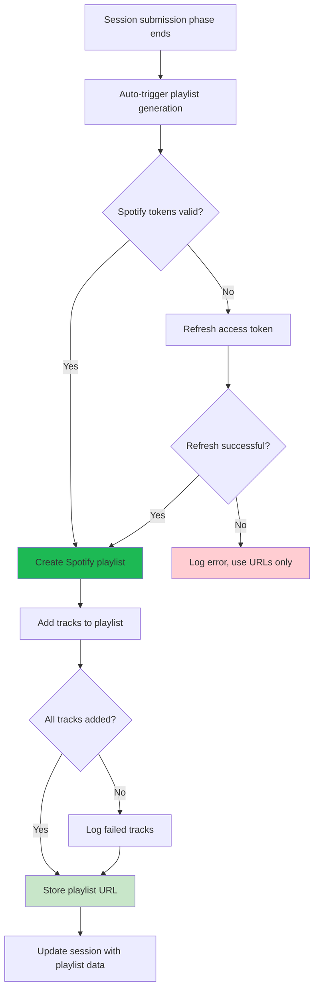
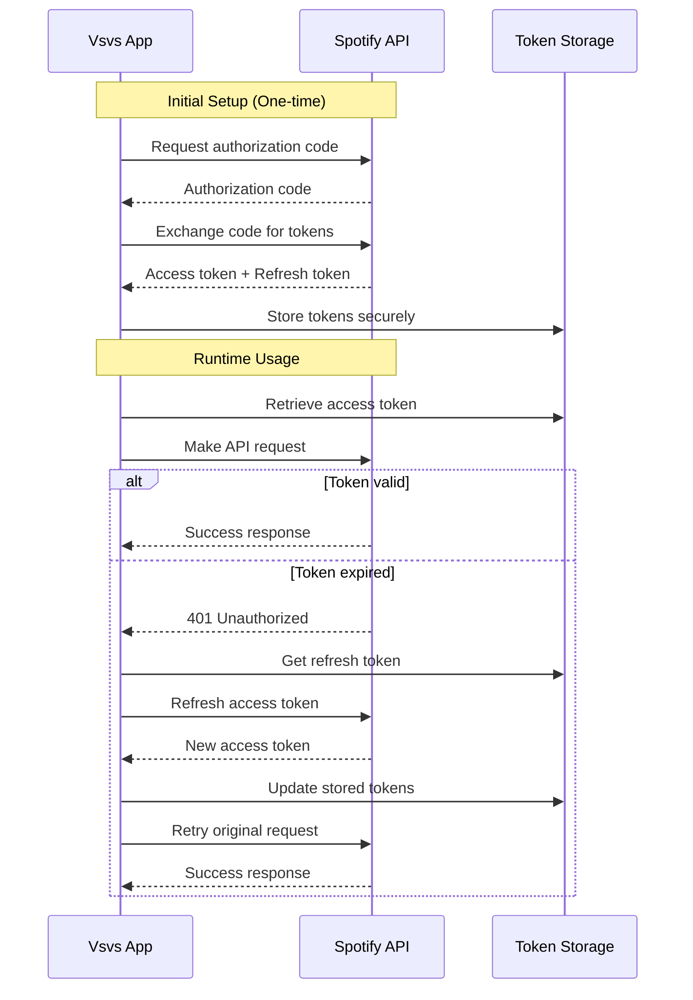
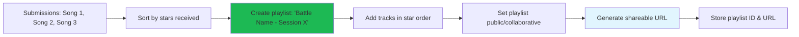
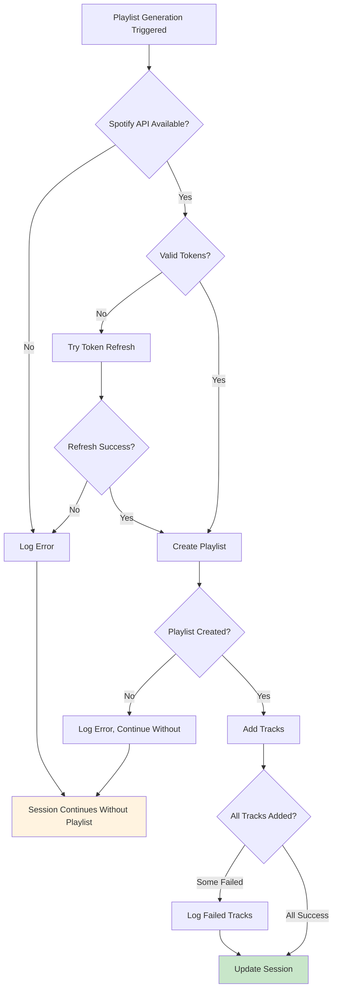

# Phase 5: Spotify Integration

## Overview

This phase implements Spotify Web API integration for automatic playlist creation using a central app account, with OAuth token management and dynamic track metadata fetching.

## Spotify Integration Architecture



## OAuth Token Management



## Playlist Creation Flow



## Core Convex Functions

### Spotify API Integration (`src/lib/server/convex/spotify.ts`)

```typescript
"use node";

import {
  internalAction,
  internalMutation,
  internalQuery,
} from "./_generated/server";
import { v } from "convex/values";
import { internal } from "./_generated/api";

/**
 * Generate Spotify playlist for a session
 */
export const generateSessionPlaylist = internalAction({
  args: { sessionId: v.id("vsSessions") },
  returns: v.null(),
  handler: async (ctx, args) => {
    try {
      const session = await ctx.runQuery(
        internal.spotify.getSessionForPlaylist,
        {
          sessionId: args.sessionId,
        },
      );

      if (!session) {
        console.error("Session not found for playlist generation");
        return null;
      }

      // Get valid Spotify access token
      const accessToken = await getValidSpotifyToken(ctx);
      if (!accessToken) {
        console.error("No valid Spotify access token available");
        return null;
      }

      // Create playlist
      const playlistResult = await createSpotifyPlaylist(
        accessToken,
        `${session.battleName} - Session ${session.sessionNumber}`,
        `Music battle playlist for "${session.vibe}" - Created by Vsvs app`,
      );

      if (!playlistResult.success) {
        console.error(
          "Failed to create Spotify playlist:",
          playlistResult.error,
        );
        return null;
      }

      // Add tracks to playlist
      const trackUris = session.submissions
        .sort((a, b) => b.starsReceived - a.starsReceived) // Sort by stars (highest first)
        .map((sub) => spotifyUrlToUri(sub.spotifyUrl))
        .filter((uri) => uri !== null);

      if (trackUris.length > 0) {
        const addTracksResult = await addTracksToPlaylist(
          accessToken,
          playlistResult.playlistId!,
          trackUris as string[],
        );

        if (!addTracksResult.success) {
          console.warn(
            "Some tracks failed to add to playlist:",
            addTracksResult.failedTracks,
          );
        }
      }

      // Store playlist data in session
      await ctx.runMutation(internal.spotify.updateSessionPlaylist, {
        sessionId: args.sessionId,
        playlistUrl: playlistResult.playlistUrl!,
        spotifyPlaylistId: playlistResult.playlistId!,
      });

      console.log(
        `Playlist created successfully: ${playlistResult.playlistUrl}`,
      );
    } catch (error) {
      console.error("Error generating session playlist:", error);
    }

    return null;
  },
});

/**
 * Get session data needed for playlist creation
 */
export const getSessionForPlaylist = internalQuery({
  args: { sessionId: v.id("vsSessions") },
  returns: v.union(
    v.null(),
    v.object({
      sessionNumber: v.number(),
      vibe: v.string(),
      battleName: v.string(),
      submissions: v.array(
        v.object({
          spotifyUrl: v.string(),
          starsReceived: v.number(),
          userEmail: v.string(),
        }),
      ),
    }),
  ),
  handler: async (ctx, args) => {
    const session = await ctx.db.get(args.sessionId);
    if (!session) return null;

    const battle = await ctx.db.get(session.battleId);
    if (!battle) return null;

    const submissions = await ctx.db
      .query("submissions")
      .withIndex("by_sessionId", (q) => q.eq("sessionId", args.sessionId))
      .collect();

    const submissionsWithUsers = await Promise.all(
      submissions.map(async (submission) => {
        const user = await ctx.db.get(submission.userId);
        return {
          spotifyUrl: submission.spotifyUrl,
          starsReceived: submission.starsReceived,
          userEmail: user?.email || "Unknown User",
        };
      }),
    );

    return {
      sessionNumber: session.sessionNumber,
      vibe: session.vibe,
      battleName: battle.name,
      submissions: submissionsWithUsers,
    };
  },
});

/**
 * Update session with playlist information
 */
export const updateSessionPlaylist = internalMutation({
  args: {
    sessionId: v.id("vsSessions"),
    playlistUrl: v.string(),
    spotifyPlaylistId: v.string(),
  },
  returns: v.null(),
  handler: async (ctx, args) => {
    await ctx.db.patch(args.sessionId, {
      playlistUrl: args.playlistUrl,
      spotifyPlaylistId: args.spotifyPlaylistId,
    });
    return null;
  },
});

/**
 * Get valid Spotify access token (refresh if needed)
 */
async function getValidSpotifyToken(ctx: any): Promise<string | null> {
  const auth = await ctx.runQuery(internal.spotify.getSpotifyAuth);
  if (!auth) return null;

  // Check if token is expired (with 5 minute buffer)
  const now = Date.now();
  const buffer = 5 * 60 * 1000; // 5 minutes

  if (auth.expiresAt > now + buffer) {
    return auth.accessToken;
  }

  // Need to refresh token
  try {
    const refreshResult = await refreshSpotifyToken(auth.refreshToken);
    if (refreshResult.success) {
      // Update stored tokens
      await ctx.runMutation(internal.spotify.updateSpotifyAuth, {
        accessToken: refreshResult.accessToken!,
        expiresAt: refreshResult.expiresAt!,
      });
      return refreshResult.accessToken!;
    }
  } catch (error) {
    console.error("Failed to refresh Spotify token:", error);
  }

  return null;
}

/**
 * Create a Spotify playlist
 */
async function createSpotifyPlaylist(
  accessToken: string,
  name: string,
  description: string,
): Promise<{
  success: boolean;
  playlistId?: string;
  playlistUrl?: string;
  error?: string;
}> {
  const SPOTIFY_CLIENT_ID = process.env.SPOTIFY_CLIENT_ID;

  if (!SPOTIFY_CLIENT_ID) {
    return { success: false, error: "Spotify client ID not configured" };
  }

  try {
    const response = await fetch(
      `https://api.spotify.com/v1/users/${SPOTIFY_CLIENT_ID}/playlists`,
      {
        method: "POST",
        headers: {
          Authorization: `Bearer ${accessToken}`,
          "Content-Type": "application/json",
        },
        body: JSON.stringify({
          name,
          description,
          public: true,
          collaborative: false,
        }),
      },
    );

    if (!response.ok) {
      const error = await response.text();
      return {
        success: false,
        error: `Spotify API error: ${response.status} ${error}`,
      };
    }

    const playlist = await response.json();

    return {
      success: true,
      playlistId: playlist.id,
      playlistUrl: playlist.external_urls.spotify,
    };
  } catch (error) {
    return { success: false, error: `Network error: ${error}` };
  }
}

/**
 * Add tracks to a Spotify playlist
 */
async function addTracksToPlaylist(
  accessToken: string,
  playlistId: string,
  trackUris: string[],
): Promise<{
  success: boolean;
  failedTracks?: string[];
}> {
  if (trackUris.length === 0) {
    return { success: true };
  }

  try {
    // Spotify API allows max 100 tracks per request
    const chunks = [];
    for (let i = 0; i < trackUris.length; i += 100) {
      chunks.push(trackUris.slice(i, i + 100));
    }

    const failedTracks: string[] = [];

    for (const chunk of chunks) {
      const response = await fetch(
        `https://api.spotify.com/v1/playlists/${playlistId}/tracks`,
        {
          method: "POST",
          headers: {
            Authorization: `Bearer ${accessToken}`,
            "Content-Type": "application/json",
          },
          body: JSON.stringify({
            uris: chunk,
          }),
        },
      );

      if (!response.ok) {
        console.warn(
          `Failed to add tracks chunk to playlist: ${response.status}`,
        );
        failedTracks.push(...chunk);
      }
    }

    return {
      success: failedTracks.length === 0,
      failedTracks: failedTracks.length > 0 ? failedTracks : undefined,
    };
  } catch (error) {
    console.error("Error adding tracks to playlist:", error);
    return { success: false, failedTracks: trackUris };
  }
}

/**
 * Refresh Spotify access token
 */
async function refreshSpotifyToken(refreshToken: string): Promise<{
  success: boolean;
  accessToken?: string;
  expiresAt?: number;
}> {
  const SPOTIFY_CLIENT_ID = process.env.SPOTIFY_CLIENT_ID;
  const SPOTIFY_CLIENT_SECRET = process.env.SPOTIFY_CLIENT_SECRET;

  if (!SPOTIFY_CLIENT_ID || !SPOTIFY_CLIENT_SECRET) {
    throw new Error("Spotify credentials not configured");
  }

  const response = await fetch("https://accounts.spotify.com/api/token", {
    method: "POST",
    headers: {
      "Content-Type": "application/x-www-form-urlencoded",
      Authorization:
        "Basic " +
        Buffer.from(`${SPOTIFY_CLIENT_ID}:${SPOTIFY_CLIENT_SECRET}`).toString(
          "base64",
        ),
    },
    body: new URLSearchParams({
      grant_type: "refresh_token",
      refresh_token: refreshToken,
    }),
  });

  if (!response.ok) {
    throw new Error(`Token refresh failed: ${response.status}`);
  }

  const data = await response.json();

  return {
    success: true,
    accessToken: data.access_token,
    expiresAt: Date.now() + data.expires_in * 1000,
  };
}

/**
 * Convert Spotify URL to URI format
 */
function spotifyUrlToUri(url: string): string | null {
  try {
    const match = url.match(/spotify\.com\/track\/([a-zA-Z0-9]+)/);
    if (match) {
      return `spotify:track:${match[1]}`;
    }

    // Already in URI format
    if (url.startsWith("spotify:track:")) {
      return url;
    }

    return null;
  } catch (error) {
    console.warn("Failed to convert Spotify URL to URI:", url);
    return null;
  }
}
```

### Spotify Auth Management (`src/lib/server/convex/spotify-auth.ts`)

```typescript
import { internalQuery, internalMutation } from "./_generated/server";
import { v } from "convex/values";

/**
 * Get stored Spotify authentication tokens
 */
export const getSpotifyAuth = internalQuery({
  args: {},
  returns: v.union(
    v.null(),
    v.object({
      accessToken: v.string(),
      refreshToken: v.string(),
      expiresAt: v.number(),
    }),
  ),
  handler: async (ctx) => {
    // In production, this should be the only record
    // For MVP, we'll store a single set of tokens for the app account
    const auth = await ctx.db.query("spotifyAuth").first();

    if (!auth) return null;

    return {
      accessToken: auth.accessToken,
      refreshToken: auth.refreshToken,
      expiresAt: auth.expiresAt,
    };
  },
});

/**
 * Store Spotify authentication tokens (initial setup)
 */
export const storeSpotifyAuth = internalMutation({
  args: {
    accessToken: v.string(),
    refreshToken: v.string(),
    expiresAt: v.number(),
  },
  returns: v.null(),
  handler: async (ctx, args) => {
    // Delete any existing auth (should only be one)
    const existing = await ctx.db.query("spotifyAuth").first();

    if (existing) {
      await ctx.db.delete(existing._id);
    }

    // Store new auth
    await ctx.db.insert("spotifyAuth", {
      accessToken: args.accessToken,
      refreshToken: args.refreshToken,
      expiresAt: args.expiresAt,
    });

    return null;
  },
});

/**
 * Update access token after refresh
 */
export const updateSpotifyAuth = internalMutation({
  args: {
    accessToken: v.string(),
    expiresAt: v.number(),
  },
  returns: v.null(),
  handler: async (ctx, args) => {
    const existing = await ctx.db.query("spotifyAuth").first();

    if (existing) {
      await ctx.db.patch(existing._id, {
        accessToken: args.accessToken,
        expiresAt: args.expiresAt,
      });
    }

    return null;
  },
});
```

### Track Metadata Utilities (`src/lib/server/convex/spotify-metadata.ts`)

```typescript
"use node";

import { internalAction } from "./_generated/server";
import { v } from "convex/values";
import { internal } from "./_generated/api";

/**
 * Fetch track metadata from Spotify API
 */
export const fetchTrackMetadata = internalAction({
  args: { spotifyUrl: v.string() },
  returns: v.union(
    v.null(),
    v.object({
      trackId: v.string(),
      name: v.string(),
      artists: v.array(v.string()),
      album: v.string(),
      imageUrl: v.optional(v.string()),
      previewUrl: v.optional(v.string()),
      durationMs: v.number(),
    }),
  ),
  handler: async (ctx, args) => {
    try {
      // Extract track ID from URL
      const trackId = extractTrackId(args.spotifyUrl);
      if (!trackId) return null;

      // Get valid access token
      const auth = await ctx.runQuery(internal.spotify.getSpotifyAuth);
      if (!auth) return null;

      // Fetch track data
      const response = await fetch(
        `https://api.spotify.com/v1/tracks/${trackId}`,
        {
          headers: {
            Authorization: `Bearer ${auth.accessToken}`,
          },
        },
      );

      if (!response.ok) {
        if (response.status === 401) {
          // Token expired, could trigger refresh here
          console.warn("Spotify token expired while fetching metadata");
        }
        return null;
      }

      const track = await response.json();

      return {
        trackId,
        name: track.name,
        artists: track.artists.map((artist: any) => artist.name),
        album: track.album.name,
        imageUrl: track.album.images?.[0]?.url,
        previewUrl: track.preview_url,
        durationMs: track.duration_ms,
      };
    } catch (error) {
      console.error("Error fetching track metadata:", error);
      return null;
    }
  },
});

function extractTrackId(url: string): string | null {
  const match = url.match(/spotify\.com\/track\/([a-zA-Z0-9]+)/);
  return match ? match[1] : null;
}
```

## Updated Schema for Spotify Integration

```typescript
// Add to schema.ts
spotifyAuth: defineTable({
  accessToken: v.string(),
  refreshToken: v.string(),
  expiresAt: v.number(),
}),

// Optional: Cache track metadata to reduce API calls
trackMetadata: defineTable({
  trackId: v.string(), // Spotify track ID
  name: v.string(),
  artists: v.array(v.string()),
  album: v.string(),
  imageUrl: v.optional(v.string()),
  previewUrl: v.optional(v.string()),
  durationMs: v.number(),
  lastFetched: v.number(),
}).index("by_trackId", ["trackId"]),
```

## Environment Variables Setup

```bash
# Add to .env.local
SPOTIFY_CLIENT_ID=your_spotify_app_client_id
SPOTIFY_CLIENT_SECRET=your_spotify_app_client_secret
SPOTIFY_REDIRECT_URI=http://localhost:3000/auth/spotify/callback
```

## Initial Spotify App Setup Script

```typescript
// scripts/setup-spotify-auth.ts - Run once to get initial tokens

import { ConvexClient } from "convex/browser";
import { internal } from "../src/lib/server/convex/_generated/api";

async function setupSpotifyAuth() {
  const client = new ConvexClient(process.env.CONVEX_URL!);

  // This would be run manually with tokens obtained from Spotify OAuth flow
  const accessToken = "YOUR_ACCESS_TOKEN";
  const refreshToken = "YOUR_REFRESH_TOKEN";
  const expiresAt = Date.now() + 3600 * 1000; // 1 hour

  await client.mutation(internal.spotify.storeSpotifyAuth, {
    accessToken,
    refreshToken,
    expiresAt,
  });

  console.log("Spotify authentication stored successfully");
}

// Run: npx tsx scripts/setup-spotify-auth.ts
setupSpotifyAuth().catch(console.error);
```

## Playlist Generation Trigger

Update the phase transition system to trigger playlist generation:

```typescript
// In phase-transitions.ts, update the submission to voting transition:

if (session.phase === "submission" && session.submissionDeadline <= now) {
  // Advance to voting phase
  await ctx.db.patch(session._id, { phase: "voting" });

  // Generate playlist (NEW)
  await ctx.scheduler.runAfter(0, internal.spotify.generateSessionPlaylist, {
    sessionId: session._id,
  });
}
```

## Error Handling & Fallbacks



## Validation Rules

1. **Token Management**:
   - Refresh tokens before expiration
   - Handle 401 errors gracefully
   - Secure token storage

2. **Playlist Creation**:
   - Unique playlist names per session
   - Public playlists for sharing
   - Sort tracks by vote count

3. **Error Handling**:
   - Continue session flow if Spotify fails
   - Log all API errors for debugging
   - Fallback to URL-only mode

4. **Rate Limiting**:
   - Respect Spotify API rate limits
   - Batch track additions efficiently
   - Retry failed requests with backoff

## Testing Requirements

1. **Unit Tests**:
   - Token refresh logic
   - URL to URI conversion
   - Playlist creation flow

2. **Integration Tests**:
   - End-to-end playlist generation
   - Token expiration scenarios
   - API error handling

3. **Manual Testing**:
   - Verify playlists appear in Spotify
   - Check track ordering matches vote results
   - Test with various track URL formats

## Next Phase Dependencies

Phase 6 (User Statistics) can use:

- Playlist URLs for historical viewing
- Track metadata for enhanced displays
- Spotify integration status for features

This phase enables the key social sharing aspect through Spotify playlists.
