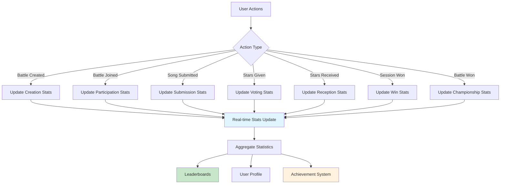
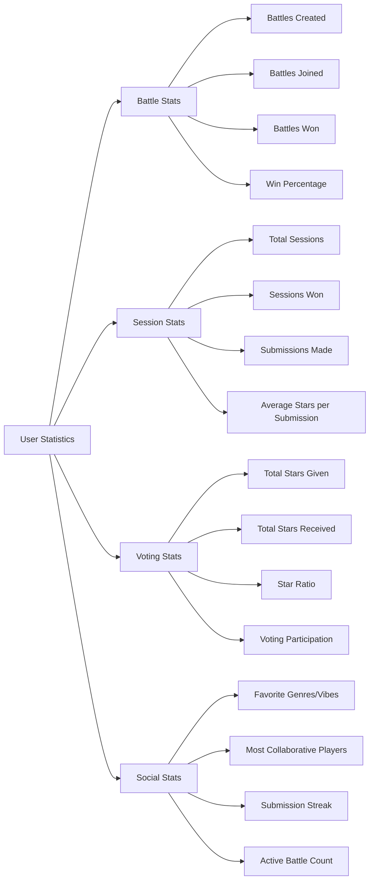
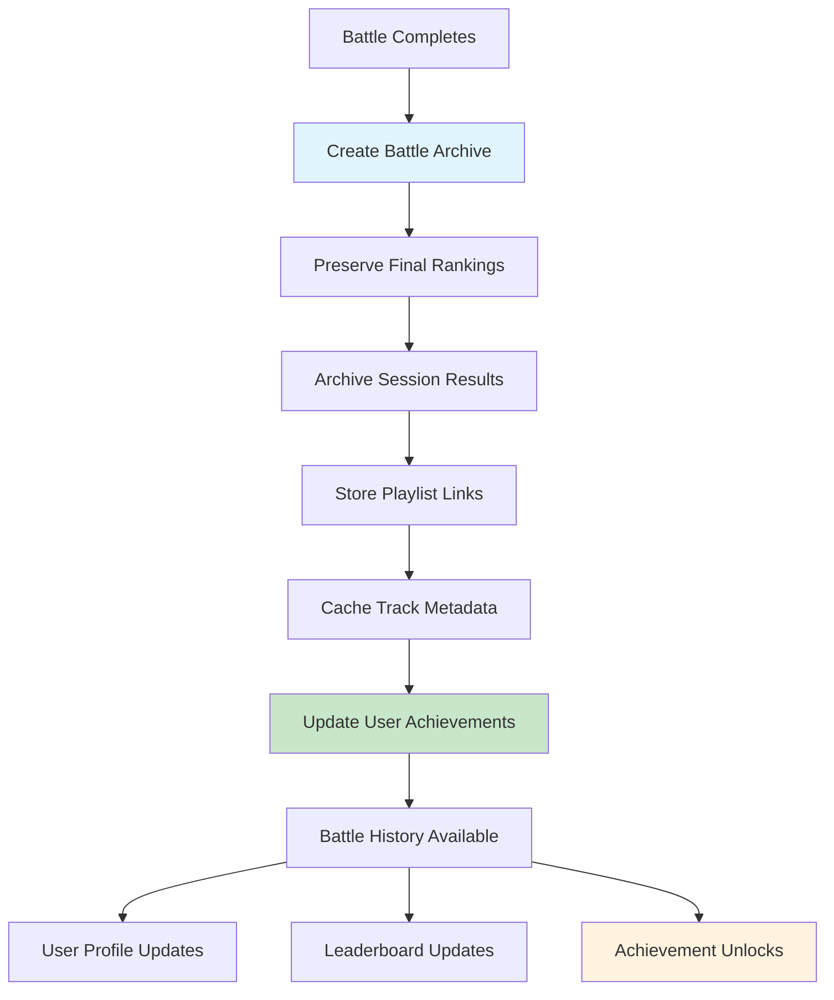
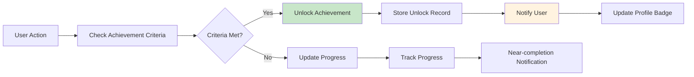
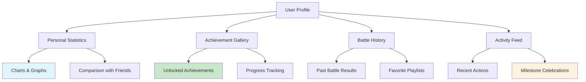

# Phase 6: User Statistics & History

## Overview

This phase implements comprehensive user statistics tracking, historical data preservation, and leaderboard functionality to enhance user engagement and provide long-term value.

## Statistics Architecture



## User Statistics Breakdown



## Core Convex Functions

### User Statistics (`src/lib/server/convex/user-stats.ts`)

```typescript
import { query, mutation, internalMutation } from "./_generated/server";
import { v } from "convex/values";

/**
 * Get comprehensive user statistics
 */
export const getUserStats = query({
  args: { userId: v.optional(v.id("user")) },
  returns: v.union(
    v.null(),
    v.object({
      user: v.object({
        _id: v.id("user"),
        email: v.string(),
        joinedAt: v.number(),
      }),
      battleStats: v.object({
        battlesCreated: v.number(),
        battlesJoined: v.number(),
        battlesWon: v.number(),
        battlesCompleted: v.number(),
        winPercentage: v.number(),
        activeBattles: v.number(),
      }),
      sessionStats: v.object({
        totalSessions: v.number(),
        sessionsWon: v.number(),
        sessionWinPercentage: v.number(),
        totalSubmissions: v.number(),
        avgStarsPerSubmission: v.number(),
      }),
      votingStats: v.object({
        totalStarsGiven: v.number(),
        totalStarsReceived: v.number(),
        starRatio: v.number(), // received/given
        votingParticipation: v.number(), // % of sessions where user voted
      }),
      achievements: v.array(
        v.object({
          id: v.string(),
          name: v.string(),
          description: v.string(),
          unlockedAt: v.number(),
          rarity: v.union(
            v.literal("common"),
            v.literal("rare"),
            v.literal("legendary"),
          ),
        }),
      ),
      recentActivity: v.array(
        v.object({
          type: v.string(),
          description: v.string(),
          timestamp: v.number(),
          battleName: v.optional(v.string()),
        }),
      ),
    }),
  ),
  handler: async (ctx, args) => {
    // Get current user if not specified
    let userId = args.userId;
    if (!userId) {
      const identity = await ctx.auth.getUserIdentity();
      if (!identity) return null;

      const user = await ctx.db
        .query("user")
        .withIndex("by_email", (q) => q.eq("email", identity.email))
        .unique();

      if (!user) return null;
      userId = user._id;
    }

    const user = await ctx.db.get(userId);
    if (!user) return null;

    // Get all battle participations
    const battleParticipations = await ctx.db
      .query("battlePlayers")
      .withIndex("by_userId", (q) => q.eq("userId", userId))
      .collect();

    // Get battles created by user
    const createdBattles = await ctx.db
      .query("battles")
      .withIndex("by_creatorId", (q) => q.eq("creatorId", userId))
      .collect();

    // Calculate battle stats
    const activeBattles = battleParticipations.filter(async (bp) => {
      const battle = await ctx.db.get(bp.battleId);
      return battle?.status === "active";
    }).length;

    const completedBattles = battleParticipations.filter(async (bp) => {
      const battle = await ctx.db.get(bp.battleId);
      return battle?.status === "completed";
    }).length;

    const battleStats = {
      battlesCreated: createdBattles.length,
      battlesJoined: battleParticipations.length,
      battlesWon: battleParticipations.reduce((sum, bp) => {
        return sum + (bp.sessionsWon > 0 ? 1 : 0); // Simplified win calculation
      }, 0),
      battlesCompleted: completedBattles,
      winPercentage:
        completedBattles > 0
          ? (battleParticipations.reduce(
              (sum, bp) => sum + (bp.sessionsWon > 0 ? 1 : 0),
              0,
            ) /
              completedBattles) *
            100
          : 0,
      activeBattles,
    };

    // Get all user submissions
    const submissions = await ctx.db
      .query("submissions")
      .withIndex("by_userId", (q) => q.eq("userId", userId))
      .collect();

    // Calculate session stats
    const totalStars = submissions.reduce(
      (sum, sub) => sum + sub.starsReceived,
      0,
    );
    const totalSessions = battleParticipations.reduce(
      (sum, bp) => sum + bp.sessionsWon,
      0,
    );

    const sessionStats = {
      totalSessions: battleParticipations.length, // Approximate
      sessionsWon: battleParticipations.reduce(
        (sum, bp) => sum + bp.sessionsWon,
        0,
      ),
      sessionWinPercentage:
        totalSessions > 0
          ? (battleParticipations.reduce((sum, bp) => sum + bp.sessionsWon, 0) /
              totalSessions) *
            100
          : 0,
      totalSubmissions: submissions.length,
      avgStarsPerSubmission:
        submissions.length > 0 ? totalStars / submissions.length : 0,
    };

    // Get voting stats
    const starsGiven = await ctx.db
      .query("stars")
      .withIndex("by_voterId", (q) => q.eq("voterId", userId))
      .collect();

    const totalStarsReceived = battleParticipations.reduce(
      (sum, bp) => sum + bp.totalStarsEarned,
      0,
    );

    const votingStats = {
      totalStarsGiven: starsGiven.length,
      totalStarsReceived,
      starRatio:
        starsGiven.length > 0 ? totalStarsReceived / starsGiven.length : 0,
      votingParticipation: 100, // Placeholder - would need more complex calculation
    };

    // Get achievements (placeholder - would be implemented with achievement system)
    const achievements = [
      {
        id: "first_battle",
        name: "Battle Creator",
        description: "Created your first battle",
        unlockedAt: createdBattles[0]?.createdAt || 0,
        rarity: "common" as const,
      },
    ].filter((a) => a.unlockedAt > 0);

    // Get recent activity
    const recentActivity = await getRecentUserActivity(ctx, userId);

    return {
      user: {
        _id: user._id,
        email: user.email,
        joinedAt: user._creationTime,
      },
      battleStats,
      sessionStats,
      votingStats,
      achievements,
      recentActivity,
    };
  },
});

/**
 * Get global leaderboards
 */
export const getLeaderboards = query({
  args: {
    category: v.union(
      v.literal("battles_won"),
      v.literal("stars_received"),
      v.literal("sessions_won"),
      v.literal("submission_quality"),
    ),
    limit: v.optional(v.number()),
  },
  returns: v.array(
    v.object({
      rank: v.number(),
      userId: v.id("user"),
      userEmail: v.string(),
      value: v.number(),
      label: v.string(),
    }),
  ),
  handler: async (ctx, args) => {
    const limit = args.limit || 10;

    switch (args.category) {
      case "battles_won":
        return await getBattleWinLeaderboard(ctx, limit);
      case "stars_received":
        return await getStarsReceivedLeaderboard(ctx, limit);
      case "sessions_won":
        return await getSessionWinLeaderboard(ctx, limit);
      case "submission_quality":
        return await getSubmissionQualityLeaderboard(ctx, limit);
      default:
        return [];
    }
  },
});

/**
 * Get user's battle history with details
 */
export const getUserBattleHistory = query({
  args: {
    userId: v.optional(v.id("user")),
    limit: v.optional(v.number()),
    status: v.optional(v.union(v.literal("active"), v.literal("completed"))),
  },
  returns: v.array(
    v.object({
      _id: v.id("battles"),
      name: v.string(),
      status: v.union(v.literal("active"), v.literal("completed")),
      createdAt: v.number(),
      isCreator: v.boolean(),
      playerCount: v.number(),
      userStats: v.object({
        sessionsWon: v.number(),
        totalStarsEarned: v.number(),
        rank: v.number(), // 1-based ranking in this battle
      }),
      currentSession: v.optional(
        v.object({
          sessionNumber: v.number(),
          vibe: v.string(),
          phase: v.string(),
        }),
      ),
      champion: v.optional(
        v.object({
          userEmail: v.string(),
          isCurrentUser: v.boolean(),
        }),
      ),
    }),
  ),
  handler: async (ctx, args) => {
    // Get current user if not specified
    let userId = args.userId;
    if (!userId) {
      const identity = await ctx.auth.getUserIdentity();
      if (!identity) return [];

      const user = await ctx.db
        .query("user")
        .withIndex("by_email", (q) => q.eq("email", identity.email))
        .unique();

      if (!user) return [];
      userId = user._id;
    }

    const limit = args.limit || 20;

    // Get user's battle participations
    const participations = await ctx.db
      .query("battlePlayers")
      .withIndex("by_userId", (q) => q.eq("userId", userId))
      .collect();

    let battlesWithDetails = await Promise.all(
      participations.map(async (participation) => {
        const battle = await ctx.db.get(participation.battleId);
        if (!battle) return null;

        // Filter by status if specified
        if (args.status && battle.status !== args.status) return null;

        // Get all players for ranking
        const allPlayers = await ctx.db
          .query("battlePlayers")
          .withIndex("by_battleId", (q) => q.eq("battleId", battle._id))
          .collect();

        // Sort by total stars to get ranking
        const sortedPlayers = allPlayers.sort(
          (a, b) => b.totalStarsEarned - a.totalStarsEarned,
        );
        const userRank =
          sortedPlayers.findIndex((p) => p.userId === userId) + 1;

        // Get current session if active
        let currentSession = null;
        if (battle.currentSessionId) {
          const session = await ctx.db.get(battle.currentSessionId);
          if (session) {
            currentSession = {
              sessionNumber: session.sessionNumber,
              vibe: session.vibe,
              phase: session.phase,
            };
          }
        }

        // Get champion if battle completed
        let champion = null;
        if (battle.status === "completed" && sortedPlayers.length > 0) {
          const championPlayer = sortedPlayers[0];
          const championUser = await ctx.db.get(championPlayer.userId);
          champion = {
            userEmail: championUser?.email || "Unknown",
            isCurrentUser: championPlayer.userId === userId,
          };
        }

        return {
          _id: battle._id,
          name: battle.name,
          status: battle.status,
          createdAt: battle.createdAt,
          isCreator: battle.creatorId === userId,
          playerCount: allPlayers.length,
          userStats: {
            sessionsWon: participation.sessionsWon,
            totalStarsEarned: participation.totalStarsEarned,
            rank: userRank,
          },
          currentSession,
          champion,
        };
      }),
    );

    // Filter out nulls and sort by creation date
    const validBattles = battlesWithDetails
      .filter((battle): battle is NonNullable<typeof battle> => battle !== null)
      .sort((a, b) => b.createdAt - a.createdAt)
      .slice(0, limit);

    return validBattles;
  },
});

/**
 * Update user statistics when events occur
 */
export const updateUserStats = internalMutation({
  args: {
    userId: v.id("user"),
    event: v.union(
      v.literal("battle_created"),
      v.literal("battle_joined"),
      v.literal("session_won"),
      v.literal("battle_won"),
      v.literal("stars_received"),
      v.literal("submission_made"),
    ),
    value: v.optional(v.number()),
    metadata: v.optional(v.any()),
  },
  returns: v.null(),
  handler: async (ctx, args) => {
    // Get or create user stats record
    let userStats = await ctx.db
      .query("userStats")
      .withIndex("by_userId", (q) => q.eq("userId", args.userId))
      .first();

    if (!userStats) {
      userStats = await ctx.db.insert("userStats", {
        userId: args.userId,
        totalBattlesJoined: 0,
        totalBattlesWon: 0,
        totalStarsEarned: 0,
        totalStarsGiven: 0,
        totalSubmissions: 0,
        lastActivityAt: Date.now(),
      });
    }

    // Update stats based on event type
    const updates: any = { lastActivityAt: Date.now() };

    switch (args.event) {
      case "battle_joined":
        updates.totalBattlesJoined = (userStats.totalBattlesJoined || 0) + 1;
        break;
      case "battle_won":
        updates.totalBattlesWon = (userStats.totalBattlesWon || 0) + 1;
        break;
      case "stars_received":
        updates.totalStarsEarned =
          (userStats.totalStarsEarned || 0) + (args.value || 1);
        break;
      case "submission_made":
        updates.totalSubmissions = (userStats.totalSubmissions || 0) + 1;
        break;
    }

    await ctx.db.patch(userStats._id, updates);
    return null;
  },
});

// Helper functions for leaderboards
async function getBattleWinLeaderboard(ctx: any, limit: number) {
  const players = await ctx.db.query("battlePlayers").collect();

  // Group by user and count battle wins
  const userWins = new Map<string, { count: number; user?: any }>();

  for (const player of players) {
    const battle = await ctx.db.get(player.battleId);
    if (battle?.status === "completed") {
      // Check if this player won the battle (simplified)
      const allBattlePlayers = await ctx.db
        .query("battlePlayers")
        .withIndex("by_battleId", (q) => q.eq("battleId", player.battleId))
        .collect();

      const maxStars = Math.max(
        ...allBattlePlayers.map((p) => p.totalStarsEarned),
      );
      if (player.totalStarsEarned === maxStars && maxStars > 0) {
        const current = userWins.get(player.userId) || { count: 0 };
        userWins.set(player.userId, { count: current.count + 1 });
      }
    }
  }

  // Convert to array and sort
  const leaderboard = await Promise.all(
    Array.from(userWins.entries())
      .sort(([, a], [, b]) => b.count - a.count)
      .slice(0, limit)
      .map(async ([userId, data], index) => {
        const user = await ctx.db.get(userId);
        return {
          rank: index + 1,
          userId,
          userEmail: user?.email || "Unknown",
          value: data.count,
          label: `${data.count} battle${data.count !== 1 ? "s" : ""} won`,
        };
      }),
  );

  return leaderboard;
}

async function getStarsReceivedLeaderboard(ctx: any, limit: number) {
  const players = await ctx.db.query("battlePlayers").collect();

  // Group by user and sum stars
  const userStars = new Map<string, number>();

  for (const player of players) {
    const current = userStars.get(player.userId) || 0;
    userStars.set(player.userId, current + player.totalStarsEarned);
  }

  // Convert to array and sort
  const leaderboard = await Promise.all(
    Array.from(userStars.entries())
      .sort(([, a], [, b]) => b - a)
      .slice(0, limit)
      .map(async ([userId, stars], index) => {
        const user = await ctx.db.get(userId);
        return {
          rank: index + 1,
          userId,
          userEmail: user?.email || "Unknown",
          value: stars,
          label: `${stars} star${stars !== 1 ? "s" : ""} earned`,
        };
      }),
  );

  return leaderboard;
}

async function getSessionWinLeaderboard(ctx: any, limit: number) {
  const players = await ctx.db.query("battlePlayers").collect();

  // Group by user and sum session wins
  const userSessionWins = new Map<string, number>();

  for (const player of players) {
    const current = userSessionWins.get(player.userId) || 0;
    userSessionWins.set(player.userId, current + player.sessionsWon);
  }

  // Convert to array and sort
  const leaderboard = await Promise.all(
    Array.from(userSessionWins.entries())
      .sort(([, a], [, b]) => b - a)
      .slice(0, limit)
      .map(async ([userId, wins], index) => {
        const user = await ctx.db.get(userId);
        return {
          rank: index + 1,
          userId,
          userEmail: user?.email || "Unknown",
          value: wins,
          label: `${wins} session${wins !== 1 ? "s" : ""} won`,
        };
      }),
  );

  return leaderboard;
}

async function getSubmissionQualityLeaderboard(ctx: any, limit: number) {
  const submissions = await ctx.db.query("submissions").collect();

  // Group by user and calculate average stars per submission
  const userQuality = new Map<string, { totalStars: number; count: number }>();

  for (const submission of submissions) {
    const current = userQuality.get(submission.userId) || {
      totalStars: 0,
      count: 0,
    };
    userQuality.set(submission.userId, {
      totalStars: current.totalStars + submission.starsReceived,
      count: current.count + 1,
    });
  }

  // Calculate averages and sort
  const leaderboard = await Promise.all(
    Array.from(userQuality.entries())
      .map(([userId, data]) => ({
        userId,
        avg: data.totalStars / data.count,
        count: data.count,
      }))
      .filter((item) => item.count >= 5) // Minimum 5 submissions for quality ranking
      .sort((a, b) => b.avg - a.avg)
      .slice(0, limit)
      .map(async (item, index) => {
        const user = await ctx.db.get(item.userId);
        return {
          rank: index + 1,
          userId: item.userId,
          userEmail: user?.email || "Unknown",
          value: Math.round(item.avg * 100) / 100,
          label: `${item.avg.toFixed(2)} avg stars/submission`,
        };
      }),
  );

  return leaderboard;
}

async function getRecentUserActivity(ctx: any, userId: string) {
  // This would aggregate recent activities from various tables
  // For now, return a placeholder
  return [
    {
      type: "battle_joined",
      description: "Joined a new battle",
      timestamp: Date.now() - 86400000, // 1 day ago
      battleName: "Epic Music Battle",
    },
  ];
}
```

## Historical Data Preservation



## Updated Schema for Statistics

```typescript
// Add to schema.ts
userStats: defineTable({
  userId: v.id("user"),
  totalBattlesJoined: v.number(),
  totalBattlesWon: v.number(),
  totalStarsEarned: v.number(),
  totalStarsGiven: v.number(),
  totalSubmissions: v.number(),
  lastActivityAt: v.number(),
  // Achievement tracking
  achievements: v.optional(v.array(v.string())), // achievement IDs
  streaks: v.optional(v.object({
    currentSubmissionStreak: v.number(),
    longestSubmissionStreak: v.number(),
    currentVotingStreak: v.number(),
    longestVotingStreak: v.number(),
  })),
}).index("by_userId", ["userId"])
  .index("by_total_stars", ["totalStarsEarned"])
  .index("by_battles_won", ["totalBattlesWon"]),

// Achievement system
achievements: defineTable({
  id: v.string(), // unique achievement identifier
  name: v.string(),
  description: v.string(),
  category: v.union(
    v.literal("battles"),
    v.literal("sessions"),
    v.literal("social"),
    v.literal("streak"),
    v.literal("special")
  ),
  rarity: v.union(v.literal("common"), v.literal("rare"), v.literal("legendary")),
  criteria: v.object({
    type: v.string(), // "battle_wins", "stars_received", etc.
    threshold: v.number(),
    timeframe: v.optional(v.string()), // "daily", "weekly", etc.
  }),
  iconUrl: v.optional(v.string()),
  isActive: v.boolean(),
}).index("by_id", ["id"])
  .index("by_category", ["category"]),

// User achievement unlocks
userAchievements: defineTable({
  userId: v.id("user"),
  achievementId: v.string(),
  unlockedAt: v.number(),
  progress: v.optional(v.number()), // for progressive achievements
}).index("by_userId", ["userId"])
  .index("by_achievement", ["achievementId"])
  .index("by_user_and_achievement", ["userId", "achievementId"]),
```

## Achievement System



## Validation Rules

1. **Statistics Accuracy**:
   - Real-time updates on user actions
   - Atomic increments prevent race conditions
   - Historical data immutable once archived

2. **Leaderboard Integrity**:
   - Minimum participation thresholds
   - Fair ranking calculations
   - Regular recalculation for accuracy

3. **Achievement System**:
   - Criteria clearly defined
   - No retroactive unlocks without reason
   - Progressive achievements track progress

4. **Data Retention**:
   - Completed battles preserved indefinitely
   - User statistics maintained across battles
   - Playlist links stored for historical access

## Testing Requirements

1. **Unit Tests**:
   - Statistics calculation accuracy
   - Leaderboard ranking logic
   - Achievement unlock conditions

2. **Integration Tests**:
   - End-to-end stats tracking through battle lifecycle
   - Achievement system integration
   - Historical data preservation

3. **Performance Tests**:
   - Leaderboard query performance
   - Statistics aggregation speed
   - Large dataset handling

## User Experience Features



## Next Phase Dependencies

Phase 7 (Real-time Features) can leverage:

- User activity tracking for live feeds
- Achievement unlocks for real-time notifications
- Leaderboard changes for competitive updates
- Statistics for personalized experiences

This phase provides the engagement and retention features that make users want to return to the app.
