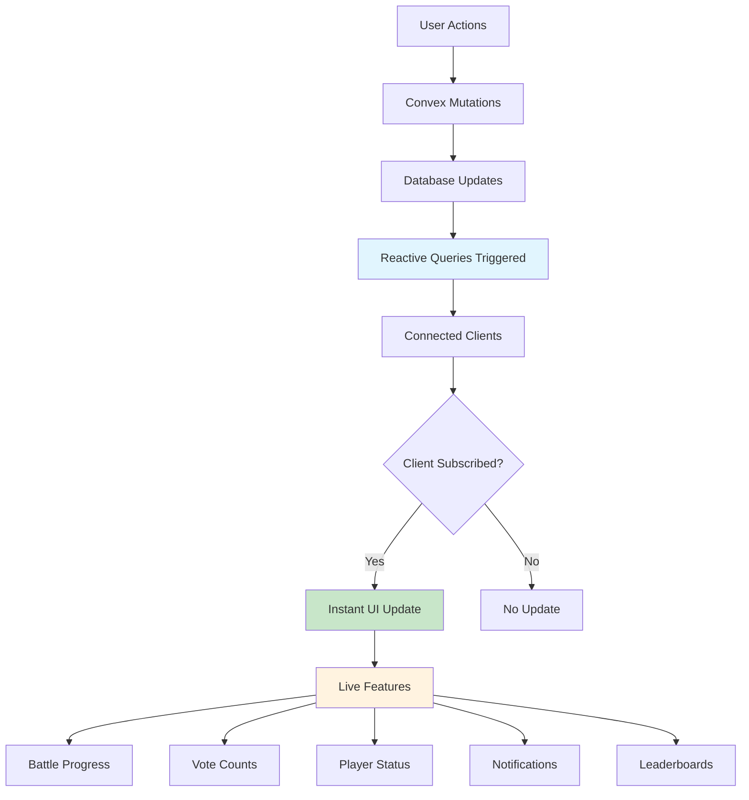
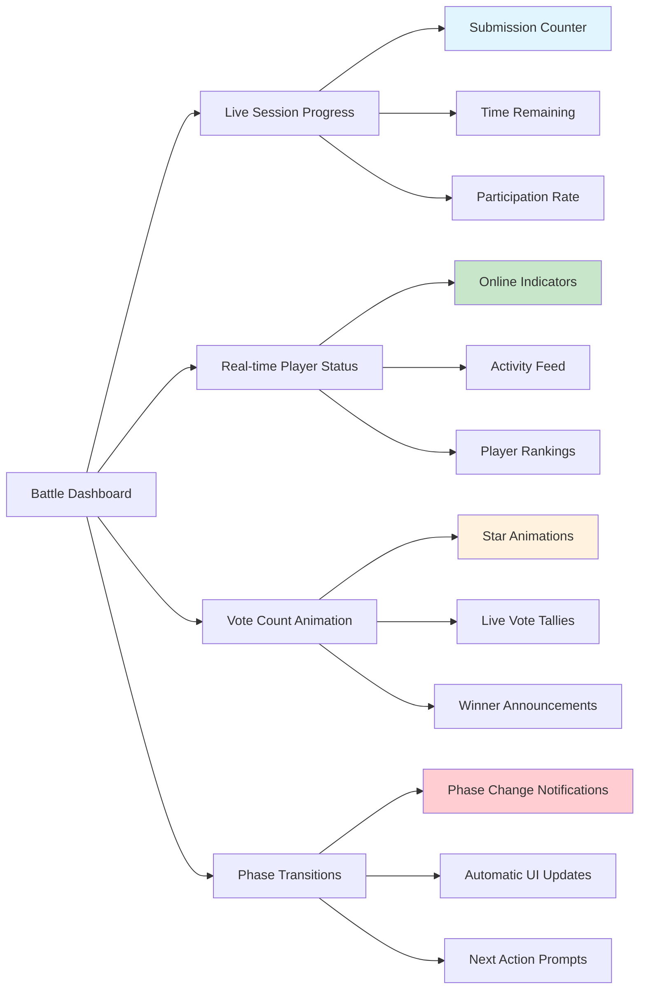
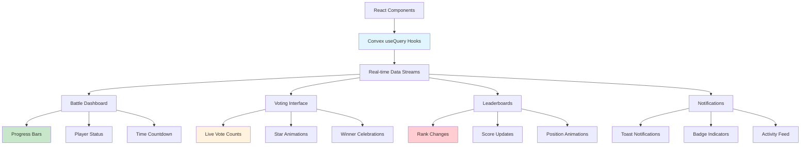
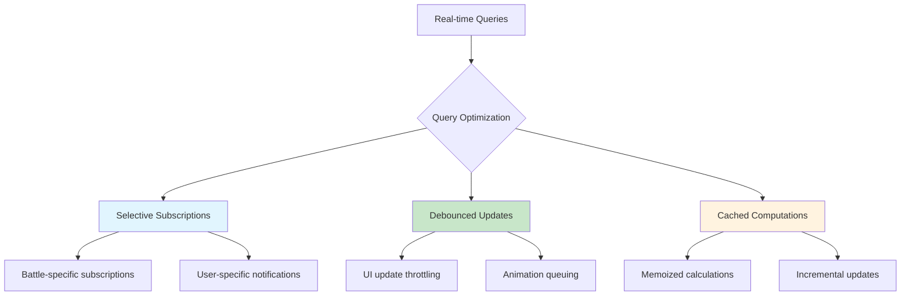

# Phase 7: Real-time Features

## Overview

This phase implements real-time updates and live features using Convex's reactive queries to enhance user engagement through live battle progress, instant notifications, and dynamic leaderboards.

## Real-time Architecture



## Live Battle Dashboard



## Core Real-time Features

### Live Battle Updates (`src/lib/server/convex/live-battle.ts`)

```typescript
import { query } from "./_generated/server";
import { v } from "convex/values";

/**
 * Live battle dashboard data - updates automatically
 */
export const getLiveBattleDashboard = query({
  args: { battleId: v.id("battles") },
  returns: v.union(
    v.null(),
    v.object({
      battle: v.object({
        _id: v.id("battles"),
        name: v.string(),
        status: v.union(v.literal("active"), v.literal("completed")),
        playerCount: v.number(),
        maxPlayers: v.number(),
      }),
      currentSession: v.union(
        v.null(),
        v.object({
          _id: v.id("vsSessions"),
          sessionNumber: v.number(),
          vibe: v.string(),
          phase: v.union(
            v.literal("pending"),
            v.literal("submission"),
            v.literal("voting"),
            v.literal("completed"),
          ),
          timeRemaining: v.object({
            phase: v.string(),
            milliseconds: v.number(),
            expired: v.boolean(),
            formattedTime: v.string(),
          }),
          progress: v.object({
            submissions: v.object({
              current: v.number(),
              expected: v.number(),
              percentage: v.number(),
            }),
            voting: v.object({
              playersCompleted: v.number(),
              totalPlayers: v.number(),
              percentage: v.number(),
            }),
          }),
        }),
      ),
      players: v.array(
        v.object({
          userId: v.id("user"),
          userEmail: v.string(),
          isOnline: v.boolean(),
          lastActivity: v.number(),
          sessionStats: v.object({
            hasSubmitted: v.boolean(),
            hasVoted: v.boolean(),
            starsUsed: v.number(),
          }),
          overallStats: v.object({
            totalStarsEarned: v.number(),
            sessionsWon: v.number(),
            rank: v.number(),
          }),
        }),
      ),
      recentActivity: v.array(
        v.object({
          type: v.union(
            v.literal("player_joined"),
            v.literal("submission_made"),
            v.literal("vote_cast"),
            v.literal("session_won"),
            v.literal("phase_changed"),
          ),
          userId: v.optional(v.id("user")),
          userEmail: v.optional(v.string()),
          description: v.string(),
          timestamp: v.number(),
          metadata: v.optional(v.any()),
        }),
      ),
    }),
  ),
  handler: async (ctx, args) => {
    const battle = await ctx.db.get(args.battleId);
    if (!battle) return null;

    // Get battle players
    const battlePlayers = await ctx.db
      .query("battlePlayers")
      .withIndex("by_battleId", (q) => q.eq("battleId", args.battleId))
      .collect();

    const playerCount = battlePlayers.length;

    // Get current session if active
    let currentSession = null;
    if (battle.currentSessionId) {
      const session = await ctx.db.get(battle.currentSessionId);
      if (session && session.phase !== "pending") {
        const now = Date.now();

        // Calculate time remaining
        let timeRemaining;
        let targetTime: number;

        if (session.phase === "submission") {
          targetTime = session.submissionDeadline;
        } else if (session.phase === "voting") {
          targetTime = session.votingDeadline;
        } else {
          targetTime = now;
        }

        const msRemaining = Math.max(0, targetTime - now);
        timeRemaining = {
          phase: session.phase,
          milliseconds: msRemaining,
          expired: msRemaining === 0,
          formattedTime: formatTimeRemaining(msRemaining),
        };

        // Get submission progress
        const submissions = await ctx.db
          .query("submissions")
          .withIndex("by_sessionId", (q) => q.eq("sessionId", session._id))
          .collect();

        const uniqueSubmitters = new Set(submissions.map((s) => s.userId)).size;
        const expectedSubmissions = battle.doubleSubmissions
          ? playerCount * 2
          : playerCount;

        const submissionProgress = {
          current: submissions.length,
          expected: expectedSubmissions,
          percentage:
            expectedSubmissions > 0
              ? Math.round((submissions.length / expectedSubmissions) * 100)
              : 0,
        };

        // Get voting progress
        const stars = await ctx.db
          .query("stars")
          .withIndex("by_sessionId", (q) => q.eq("sessionId", session._id))
          .collect();

        const voterProgress = new Map<string, number>();
        for (const star of stars) {
          voterProgress.set(
            star.voterId,
            (voterProgress.get(star.voterId) || 0) + 1,
          );
        }

        const playersCompleted = Array.from(voterProgress.values()).filter(
          (count) => count === 3,
        ).length;
        const votingProgress = {
          playersCompleted,
          totalPlayers: playerCount,
          percentage:
            playerCount > 0
              ? Math.round((playersCompleted / playerCount) * 100)
              : 0,
        };

        currentSession = {
          _id: session._id,
          sessionNumber: session.sessionNumber,
          vibe: session.vibe,
          phase: session.phase,
          timeRemaining,
          progress: {
            submissions: submissionProgress,
            voting: votingProgress,
          },
        };
      }
    }

    // Get player details with live status
    const players = await Promise.all(
      battlePlayers.map(async (battlePlayer) => {
        const user = await ctx.db.get(battlePlayer.userId);

        // Get session-specific stats
        let sessionStats = {
          hasSubmitted: false,
          hasVoted: false,
          starsUsed: 0,
        };

        if (currentSession) {
          const userSubmissions = await ctx.db
            .query("submissions")
            .withIndex("by_session_and_user", (q) =>
              q
                .eq("sessionId", currentSession._id)
                .eq("userId", battlePlayer.userId),
            )
            .collect();

          const userStars = await ctx.db
            .query("stars")
            .withIndex("by_session_and_voter", (q) =>
              q
                .eq("sessionId", currentSession._id)
                .eq("voterId", battlePlayer.userId),
            )
            .collect();

          sessionStats = {
            hasSubmitted: userSubmissions.length > 0,
            hasVoted: userStars.length === 3,
            starsUsed: userStars.length,
          };
        }

        // Calculate rank among players
        const sortedPlayers = [...battlePlayers].sort(
          (a, b) => b.totalStarsEarned - a.totalStarsEarned,
        );
        const rank =
          sortedPlayers.findIndex((p) => p.userId === battlePlayer.userId) + 1;

        return {
          userId: battlePlayer.userId,
          userEmail: user?.email || "Unknown",
          isOnline: isUserOnline(battlePlayer.userId), // Placeholder - would need presence system
          lastActivity: Date.now() - Math.random() * 3600000, // Placeholder
          sessionStats,
          overallStats: {
            totalStarsEarned: battlePlayer.totalStarsEarned,
            sessionsWon: battlePlayer.sessionsWon,
            rank,
          },
        };
      }),
    );

    // Get recent activity
    const recentActivity = await getRecentBattleActivity(ctx, args.battleId);

    return {
      battle: {
        _id: battle._id,
        name: battle.name,
        status: battle.status,
        playerCount,
        maxPlayers: battle.maxPlayers,
      },
      currentSession,
      players: players.sort(
        (a, b) => a.overallStats.rank - b.overallStats.rank,
      ),
      recentActivity,
    };
  },
});

/**
 * Live voting interface - shows real-time vote counts
 */
export const getLiveVotingState = query({
  args: { sessionId: v.id("vsSessions") },
  returns: v.union(
    v.null(),
    v.object({
      session: v.object({
        _id: v.id("vsSessions"),
        vibe: v.string(),
        phase: v.string(),
        timeRemaining: v.number(),
      }),
      submissions: v.array(
        v.object({
          _id: v.id("submissions"),
          userId: v.id("user"),
          userEmail: v.string(),
          spotifyUrl: v.string(),
          submissionOrder: v.number(),
          starsReceived: v.number(),
          recentVotes: v.array(
            v.object({
              voterEmail: v.string(),
              votedAt: v.number(),
            }),
          ),
          canVoteFor: v.boolean(),
          userHasVoted: v.boolean(),
        }),
      ),
      userVotingState: v.union(
        v.null(),
        v.object({
          starsRemaining: v.number(),
          votedSubmissions: v.array(v.id("submissions")),
          canVote: v.boolean(),
        }),
      ),
      liveStats: v.object({
        totalVotes: v.number(),
        participationRate: v.number(),
        averageStarsPerSubmission: v.number(),
        topSubmissions: v.array(v.id("submissions")),
      }),
    }),
  ),
  handler: async (ctx, args) => {
    const session = await ctx.db.get(args.sessionId);
    if (!session || session.phase !== "voting") return null;

    // Get current user
    const identity = await ctx.auth.getUserIdentity();
    let currentUser = null;
    if (identity) {
      currentUser = await ctx.db
        .query("user")
        .withIndex("by_email", (q) => q.eq("email", identity.email))
        .unique();
    }

    // Get all submissions for this session
    const submissions = await ctx.db
      .query("submissions")
      .withIndex("by_sessionId", (q) => q.eq("sessionId", args.sessionId))
      .collect();

    // Get all stars for this session
    const allStars = await ctx.db
      .query("stars")
      .withIndex("by_sessionId", (q) => q.eq("sessionId", args.sessionId))
      .collect();

    // Get user's voting state
    let userVotingState = null;
    if (currentUser) {
      const userStars = allStars.filter(
        (star) => star.voterId === currentUser._id,
      );
      const votedSubmissions = userStars.map((star) => star.submissionId);

      userVotingState = {
        starsRemaining: 3 - userStars.length,
        votedSubmissions,
        canVote:
          session.phase === "voting" &&
          Date.now() <= session.votingDeadline &&
          userStars.length < 3,
      };
    }

    // Build submission details with live vote data
    const submissionsWithVotes = await Promise.all(
      submissions.map(async (submission) => {
        const user = await ctx.db.get(submission.userId);

        // Get recent votes (last 5 minutes)
        const recentCutoff = Date.now() - 5 * 60 * 1000;
        const submissionStars = allStars.filter(
          (star) => star.submissionId === submission._id,
        );
        const recentStars = submissionStars.filter(
          (star) => star.votedAt >= recentCutoff,
        );

        const recentVotes = await Promise.all(
          recentStars.map(async (star) => {
            const voter = await ctx.db.get(star.voterId);
            return {
              voterEmail: voter?.email || "Anonymous",
              votedAt: star.votedAt,
            };
          }),
        );

        const canVoteFor =
          currentUser &&
          submission.userId !== currentUser._id &&
          userVotingState?.canVote === true;

        const userHasVoted =
          userVotingState?.votedSubmissions.includes(submission._id) === true;

        return {
          _id: submission._id,
          userId: submission.userId,
          userEmail: user?.email || "Unknown",
          spotifyUrl: submission.spotifyUrl,
          submissionOrder: submission.submissionOrder,
          starsReceived: submission.starsReceived,
          recentVotes: recentVotes
            .sort((a, b) => b.votedAt - a.votedAt)
            .slice(0, 5),
          canVoteFor,
          userHasVoted,
        };
      }),
    );

    // Calculate live stats
    const totalVotes = allStars.length;
    const battlePlayers = await ctx.db
      .query("battlePlayers")
      .withIndex("by_battleId", (q) => q.eq("battleId", session.battleId))
      .collect();

    const maxPossibleVotes = battlePlayers.length * 3;
    const participationRate =
      maxPossibleVotes > 0 ? (totalVotes / maxPossibleVotes) * 100 : 0;

    const averageStarsPerSubmission =
      submissions.length > 0 ? totalVotes / submissions.length : 0;

    const topSubmissions = submissionsWithVotes
      .sort((a, b) => b.starsReceived - a.starsReceived)
      .slice(0, 3)
      .map((s) => s._id);

    return {
      session: {
        _id: session._id,
        vibe: session.vibe,
        phase: session.phase,
        timeRemaining: Math.max(0, session.votingDeadline - Date.now()),
      },
      submissions: submissionsWithVotes.sort(
        (a, b) => b.starsReceived - a.starsReceived,
      ),
      userVotingState,
      liveStats: {
        totalVotes,
        participationRate: Math.round(participationRate),
        averageStarsPerSubmission:
          Math.round(averageStarsPerSubmission * 100) / 100,
        topSubmissions,
      },
    };
  },
});

/**
 * Live leaderboard with real-time updates
 */
export const getLiveLeaderboard = query({
  args: {
    type: v.union(
      v.literal("global"),
      v.literal("battle"),
      v.literal("session"),
    ),
    id: v.optional(v.union(v.id("battles"), v.id("vsSessions"))),
    limit: v.optional(v.number()),
  },
  returns: v.array(
    v.object({
      rank: v.number(),
      userId: v.id("user"),
      userEmail: v.string(),
      score: v.number(),
      label: v.string(),
      change: v.optional(
        v.object({
          direction: v.union(
            v.literal("up"),
            v.literal("down"),
            v.literal("same"),
          ),
          positions: v.number(),
        }),
      ),
      isOnline: v.boolean(),
    }),
  ),
  handler: async (ctx, args) => {
    const limit = args.limit || 10;

    switch (args.type) {
      case "global":
        return await getGlobalLiveLeaderboard(ctx, limit);
      case "battle":
        if (!args.id) return [];
        return await getBattleLiveLeaderboard(ctx, args.id as any, limit);
      case "session":
        if (!args.id) return [];
        return await getSessionLiveLeaderboard(ctx, args.id as any, limit);
      default:
        return [];
    }
  },
});

// Helper functions
function formatTimeRemaining(ms: number): string {
  if (ms <= 0) return "Time's up!";

  const hours = Math.floor(ms / (1000 * 60 * 60));
  const minutes = Math.floor((ms % (1000 * 60 * 60)) / (1000 * 60));
  const seconds = Math.floor((ms % (1000 * 60)) / 1000);

  if (hours > 0) {
    return `${hours}h ${minutes}m`;
  } else if (minutes > 0) {
    return `${minutes}m ${seconds}s`;
  } else {
    return `${seconds}s`;
  }
}

function isUserOnline(userId: string): boolean {
  // Placeholder - would integrate with presence system
  return Math.random() > 0.3; // 70% chance user is "online"
}

async function getRecentBattleActivity(ctx: any, battleId: string) {
  // This would aggregate recent activities from various sources
  // Placeholder implementation
  return [
    {
      type: "vote_cast" as const,
      userId: "user123" as any,
      userEmail: "user@example.com",
      description: "Voted for a submission",
      timestamp: Date.now() - 30000, // 30 seconds ago
    },
  ];
}

async function getGlobalLiveLeaderboard(ctx: any, limit: number) {
  // Implementation similar to Phase 6 but with live updates
  return [];
}

async function getBattleLiveLeaderboard(
  ctx: any,
  battleId: string,
  limit: number,
) {
  // Battle-specific leaderboard with real-time updates
  return [];
}

async function getSessionLiveLeaderboard(
  ctx: any,
  sessionId: string,
  limit: number,
) {
  // Session-specific leaderboard during voting
  return [];
}
```

### Real-time Notifications (`src/lib/server/convex/notifications.ts`)

```typescript
import { query, mutation } from "./_generated/server";
import { v } from "convex/values";

/**
 * Get live notifications for current user
 */
export const getLiveNotifications = query({
  args: {
    limit: v.optional(v.number()),
    includeRead: v.optional(v.boolean()),
  },
  returns: v.array(
    v.object({
      _id: v.id("notifications"),
      type: v.union(
        v.literal("battle_invite"),
        v.literal("session_started"),
        v.literal("voting_started"),
        v.literal("session_won"),
        v.literal("battle_completed"),
        v.literal("achievement_unlocked"),
        v.literal("leaderboard_change"),
      ),
      title: v.string(),
      message: v.string(),
      isRead: v.boolean(),
      createdAt: v.number(),
      expiresAt: v.optional(v.number()),
      actionUrl: v.optional(v.string()),
      metadata: v.optional(v.any()),
    }),
  ),
  handler: async (ctx, args) => {
    const identity = await ctx.auth.getUserIdentity();
    if (!identity) return [];

    const user = await ctx.db
      .query("user")
      .withIndex("by_email", (q) => q.eq("email", identity.email))
      .unique();

    if (!user) return [];

    const limit = args.limit || 20;
    const includeRead = args.includeRead || false;

    let query = ctx.db
      .query("notifications")
      .withIndex("by_userId", (q) => q.eq("userId", user._id));

    if (!includeRead) {
      query = query.filter((q) => q.eq(q.field("isRead"), false));
    }

    const notifications = await query.order("desc").take(limit);

    return notifications;
  },
});

/**
 * Mark notification as read
 */
export const markNotificationRead = mutation({
  args: { notificationId: v.id("notifications") },
  returns: v.object({
    success: v.boolean(),
    message: v.string(),
  }),
  handler: async (ctx, args) => {
    const identity = await ctx.auth.getUserIdentity();
    if (!identity) {
      return { success: false, message: "Must be authenticated" };
    }

    const user = await ctx.db
      .query("user")
      .withIndex("by_email", (q) => q.eq("email", identity.email))
      .unique();

    if (!user) {
      return { success: false, message: "User not found" };
    }

    const notification = await ctx.db.get(args.notificationId);
    if (!notification) {
      return { success: false, message: "Notification not found" };
    }

    if (notification.userId !== user._id) {
      return { success: false, message: "Not authorized" };
    }

    await ctx.db.patch(args.notificationId, {
      isRead: true,
    });

    return { success: true, message: "Notification marked as read" };
  },
});
```

## Live UI Components Architecture



## Frontend Integration Examples

### Live Battle Dashboard Component

```typescript
// src/lib/components/LiveBattleDashboard.svelte
import { api } from "$lib/server/convex/_generated/api";
import { useQuery } from "convex-svelte";

export let battleId: string;

// Real-time battle data - updates automatically
$: battleData = useQuery(api.liveBattle.getLiveBattleDashboard, { battleId });

// Reactive animations based on data changes
$: if ($battleData?.currentSession?.progress.voting.percentage === 100) {
  // Trigger celebration animation
  showCelebration();
}

function showCelebration() {
  // Animation logic
}
```

### Live Voting Interface

```typescript
// src/lib/components/LiveVoting.svelte
import { api } from "$lib/server/convex/_generated/api";
import { useQuery, useMutation } from "convex-svelte";

export let sessionId: string;

// Real-time voting data
$: votingData = useQuery(api.liveBattle.getLiveVotingState, { sessionId });

// Mutation for voting
const awardStar = useMutation(api.voting.awardStar);

// Watch for new votes and animate
$: if ($votingData?.submissions) {
  animateNewVotes($votingData.submissions);
}

function animateNewVotes(submissions: any[]) {
  // Check for star count changes and animate
}
```

## Updated Schema for Real-time Features

```typescript
// Add to schema.ts
notifications: defineTable({
  userId: v.id("user"),
  type: v.union(
    v.literal("battle_invite"),
    v.literal("session_started"),
    v.literal("voting_started"),
    v.literal("session_won"),
    v.literal("battle_completed"),
    v.literal("achievement_unlocked"),
    v.literal("leaderboard_change")
  ),
  title: v.string(),
  message: v.string(),
  isRead: v.boolean(),
  createdAt: v.number(),
  expiresAt: v.optional(v.number()),
  actionUrl: v.optional(v.string()),
  metadata: v.optional(v.any()),
}).index("by_userId", ["userId"])
  .index("by_user_and_read", ["userId", "isRead"])
  .index("by_createdAt", ["createdAt"]),

// User presence tracking (optional)
userPresence: defineTable({
  userId: v.id("user"),
  lastSeen: v.number(),
  isOnline: v.boolean(),
  currentBattleId: v.optional(v.id("battles")),
  currentPage: v.optional(v.string()),
}).index("by_userId", ["userId"])
  .index("by_isOnline", ["isOnline"]),
```

## Performance Optimizations



## Real-time Features List

1. **Battle Progress Tracking**:
   - Live submission counters
   - Voting progress bars
   - Phase transition animations
   - Time remaining countdowns

2. **Interactive Voting**:
   - Instant star count updates
   - Live vote animations
   - Real-time winner calculations
   - Participation indicators

3. **Social Features**:
   - Online player indicators
   - Activity feed updates
   - Achievement notifications
   - Live chat (future enhancement)

4. **Competitive Elements**:
   - Live leaderboard updates
   - Rank change animations
   - Victory celebrations
   - Statistics updates

## Validation Rules

1. **Real-time Data Integrity**:
   - Consistent state across all clients
   - Atomic updates prevent race conditions
   - Error boundaries for connection issues

2. **Performance Standards**:
   - Sub-second update propagation
   - Smooth animations at 60fps
   - Efficient query subscriptions

3. **User Experience**:
   - Graceful degradation for offline users
   - Clear loading and error states
   - Intuitive real-time feedback

## Testing Requirements

1. **Real-time Testing**:
   - Multi-client synchronization
   - Connection loss scenarios
   - High-frequency update handling

2. **Performance Testing**:
   - Memory leak detection
   - Query efficiency under load
   - Animation performance

3. **User Experience Testing**:
   - Cross-browser compatibility
   - Mobile responsiveness
   - Accessibility with dynamic content

## Implementation Priority

1. **Phase 7A**: Core real-time queries
2. **Phase 7B**: Live battle dashboard
3. **Phase 7C**: Real-time voting interface
4. **Phase 7D**: Notifications system
5. **Phase 7E**: Live leaderboards
6. **Phase 7F**: Advanced animations and effects

`★ Insight ─────────────────────────────────────`
Phase 7 transforms Vsvs into a truly engaging real-time experience. Convex's reactive queries eliminate the complexity of WebSocket management while providing instant updates that keep users connected and engaged throughout each battle.
`─────────────────────────────────────────────────`

This completes the comprehensive implementation plan for Vsvs, covering all seven phases from basic schema to real-time features.
